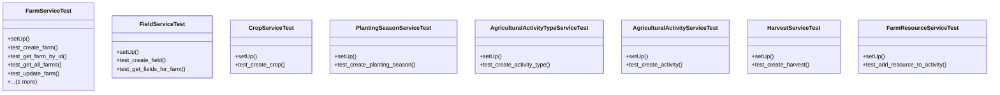

# agricultural_modules.farms.tests.test_services

## Imports
- django.contrib.auth.models
- django.test
- models
- services

## Classes
- FarmServiceTest
  - method: `setUp`
  - method: `test_create_farm`
  - method: `test_get_farm_by_id`
  - method: `test_get_all_farms`
  - method: `test_update_farm`
  - method: `test_delete_farm`
- FieldServiceTest
  - method: `setUp`
  - method: `test_create_field`
  - method: `test_get_fields_for_farm`
- CropServiceTest
  - method: `setUp`
  - method: `test_create_crop`
- PlantingSeasonServiceTest
  - method: `setUp`
  - method: `test_create_planting_season`
- AgriculturalActivityTypeServiceTest
  - method: `setUp`
  - method: `test_create_activity_type`
- AgriculturalActivityServiceTest
  - method: `setUp`
  - method: `test_create_activity`
- HarvestServiceTest
  - method: `setUp`
  - method: `test_create_harvest`
- FarmResourceServiceTest
  - method: `setUp`
  - method: `test_add_resource_to_activity`

## Functions
- setUp
- test_create_farm
- test_get_farm_by_id
- test_get_all_farms
- test_update_farm
- test_delete_farm
- setUp
- test_create_field
- test_get_fields_for_farm
- setUp
- test_create_crop
- setUp
- test_create_planting_season
- setUp
- test_create_activity_type
- setUp
- test_create_activity
- setUp
- test_create_harvest
- setUp
- test_add_resource_to_activity

## Class Diagram

