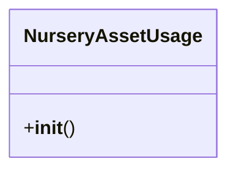

# agricultural_modules.nurseries.integration_assets

## Imports
- business_modules.assets.models
- django.contrib.auth
- django.db
- django.shortcuts
- django.utils
- models

## Classes
- NurseryAssetUsage
  - method: `__init__`

## Functions
- link_equipment_to_nursery_activity
- assign_assets_to_nursery_site
- transfer_asset_between_nursery_sites
- record_asset_maintenance_in_nursery
- __init__

## Class Diagram

