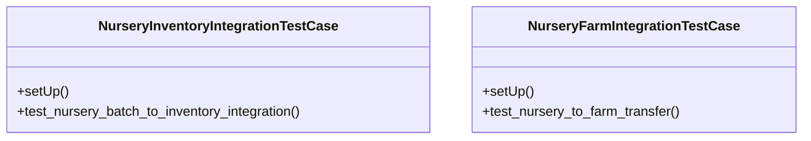

# agricultural_modules.nurseries.integration_tests

## Imports
- agricultural_modules.farms.models
- agricultural_modules.nurseries.models
- business_modules.inventory.models
- django.contrib.auth
- django.db
- django.test
- os
- sys

## Classes
- NurseryInventoryIntegrationTestCase
  - method: `setUp`
  - method: `test_nursery_batch_to_inventory_integration`
- NurseryFarmIntegrationTestCase
  - method: `setUp`
  - method: `test_nursery_to_farm_transfer`

## Functions
- setUp
- test_nursery_batch_to_inventory_integration
- setUp
- test_nursery_to_farm_transfer

## Module Variables
- `User`

## Class Diagram

