# agricultural_modules.nurseries.models

## Imports
- django.conf
- django.db

## Classes
- Nursery
  - attr: `name`
  - attr: `location`
  - attr: `area`
  - attr: `manager`
  - attr: `created_at`
  - attr: `updated_at`
  - method: `__str__`
- NurserySection
  - attr: `nursery`
  - attr: `name`
  - attr: `section_type`
  - attr: `area`
  - attr: `capacity`
  - attr: `created_at`
  - attr: `updated_at`
  - method: `__str__`
- PlantVariety
  - attr: `name`
  - attr: `scientific_name`
  - attr: `description`
  - attr: `created_at`
  - attr: `updated_at`
  - method: `__str__`
- GrowthStage
  - attr: `name`
  - attr: `description`
  - attr: `order`
  - attr: `plant_variety`
  - method: `__str__`
- ProductionBatch
  - attr: `batch_identifier`
  - attr: `plant_variety`
  - attr: `nursery_section`
  - attr: `start_date`
  - attr: `initial_quantity`
  - attr: `current_quantity`
  - attr: `current_growth_stage`
  - attr: `status_choices`
  - attr: `status`
  - attr: `notes`
  - attr: `created_at`
  - attr: `updated_at`
  - method: `save`
  - method: `__str__`
- BatchStageLog
  - attr: `production_batch`
  - attr: `growth_stage`
  - attr: `entry_date`
  - attr: `exit_date`
  - attr: `notes`
  - method: `__str__`
- NurseryActivityType
  - attr: `name`
  - attr: `description`
  - method: `__str__`
- NurseryActivity
  - attr: `activity_type`
  - attr: `production_batch`
  - attr: `nursery_batch`
  - attr: `nursery_section`
  - attr: `performed_by`
  - attr: `date_performed`
  - attr: `cost`
  - attr: `notes`
  - attr: `created_at`
  - method: `__str__`
- NurseryResource
  - attr: `name`
  - attr: `resource_type_choices`
  - attr: `resource_type`
  - attr: `unit_of_measure`
  - attr: `description`
  - method: `__str__`
- ActivityResourceUsage
  - attr: `nursery_activity`
  - attr: `resource`
  - attr: `quantity_used`
  - attr: `cost`
  - method: `__str__`
- QualityCheck
  - attr: `production_batch`
  - attr: `check_date`
  - attr: `checked_by`
  - attr: `overall_quality_choices`
  - attr: `overall_quality`
  - attr: `parameters_checked`
  - attr: `notes`
  - attr: `created_at`
  - method: `__str__`
- EnvironmentalLog
  - attr: `nursery_section`
  - attr: `log_datetime`
  - attr: `temperature`
  - attr: `humidity`
  - attr: `light_intensity`
  - attr: `recorded_by`
  - attr: `notes`
  - method: `__str__`
- NurserySite
  - attr: `name`
  - attr: `nursery_type`
  - attr: `total_area`
  - attr: `designed_capacity`
  - attr: `created_by`
  - method: `__str__`
- NurseryArea
  - attr: `nursery_site`
  - attr: `name`
  - attr: `area_size`
  - attr: `capacity`
  - method: `__str__`
- PlantSpecies
  - attr: `name`
  - attr: `scientific_name`
  - attr: `species_type`
  - method: `__str__`
- NurseryBatch
  - attr: `plant_species`
  - attr: `nursery_site`
  - attr: `nursery_area`
  - attr: `initial_quantity`
  - attr: `current_quantity`
  - attr: `entry_date`
  - attr: `created_by`
  - method: `__str__`
- Meta
  - attr: `verbose_name`
  - attr: `verbose_name_plural`
- Meta
  - attr: `verbose_name`
  - attr: `verbose_name_plural`
- Meta
  - attr: `verbose_name`
  - attr: `verbose_name_plural`
- Meta
  - attr: `verbose_name`
  - attr: `verbose_name_plural`
  - attr: `ordering`
- Meta
  - attr: `verbose_name`
  - attr: `verbose_name_plural`
- Meta
  - attr: `verbose_name`
  - attr: `verbose_name_plural`
  - attr: `ordering`
- Meta
  - attr: `verbose_name`
  - attr: `verbose_name_plural`
- Meta
  - attr: `verbose_name`
  - attr: `verbose_name_plural`
- Meta
  - attr: `verbose_name`
  - attr: `verbose_name_plural`
- Meta
  - attr: `verbose_name`
  - attr: `verbose_name_plural`
- Meta
  - attr: `verbose_name`
  - attr: `verbose_name_plural`

## Functions
- __str__
- __str__
- __str__
- __str__
- save
- __str__
- __str__
- __str__
- __str__
- __str__
- __str__
- __str__
- __str__
- __str__
- __str__
- __str__
- __str__

## Class Diagram

```mermaid
classDiagram
    class Nursery {
        +name
        +location
        +area
        +manager
        +created_at
        +... (1 more)
        +__str__()
    }
    class NurserySection {
        +nursery
        +name
        +section_type
        +area
        +capacity
        +... (2 more)
        +__str__()
    }
    class PlantVariety {
        +name
        +scientific_name
        +description
        +created_at
        +updated_at
        +__str__()
    }
    class GrowthStage {
        +name
        +description
        +order
        +plant_variety
        +__str__()
    }
    class ProductionBatch {
        +batch_identifier
        +plant_variety
        +nursery_section
        +start_date
        +initial_quantity
        +... (7 more)
        +save()
        +__str__()
    }
    class BatchStageLog {
        +production_batch
        +growth_stage
        +entry_date
        +exit_date
        +notes
        +__str__()
    }
    class NurseryActivityType {
        +name
        +description
        +__str__()
    }
    class NurseryActivity {
        +activity_type
        +production_batch
        +nursery_batch
        +nursery_section
        +performed_by
        +... (4 more)
        +__str__()
    }
    class NurseryResource {
        +name
        +resource_type_choices
        +resource_type
        +unit_of_measure
        +description
        +__str__()
    }
    class ActivityResourceUsage {
        +nursery_activity
        +resource
        +quantity_used
        +cost
        +__str__()
    }
    class QualityCheck {
        +production_batch
        +check_date
        +checked_by
        +overall_quality_choices
        +overall_quality
        +... (3 more)
        +__str__()
    }
    class EnvironmentalLog {
        +nursery_section
        +log_datetime
        +temperature
        +humidity
        +light_intensity
        +... (2 more)
        +__str__()
    }
    class NurserySite {
        +name
        +nursery_type
        +total_area
        +designed_capacity
        +created_by
        +__str__()
    }
    class NurseryArea {
        +nursery_site
        +name
        +area_size
        +capacity
        +__str__()
    }
    class PlantSpecies {
        +name
        +scientific_name
        +species_type
        +__str__()
    }
    class NurseryBatch {
        +plant_species
        +nursery_site
        +nursery_area
        +initial_quantity
        +current_quantity
        +... (2 more)
        +__str__()
    }
    class Meta {
        +verbose_name
        +verbose_name_plural
    }
    class Meta {
        +verbose_name
        +verbose_name_plural
    }
    class Meta {
        +verbose_name
        +verbose_name_plural
    }
    class Meta {
        +verbose_name
        +verbose_name_plural
        +ordering
    }
    class Meta {
        +verbose_name
        +verbose_name_plural
    }
    class Meta {
        +verbose_name
        +verbose_name_plural
        +ordering
    }
    class Meta {
        +verbose_name
        +verbose_name_plural
    }
    class Meta {
        +verbose_name
        +verbose_name_plural
    }
    class Meta {
        +verbose_name
        +verbose_name_plural
    }
    class Meta {
        +verbose_name
        +verbose_name_plural
    }
    class Meta {
        +verbose_name
        +verbose_name_plural
    }
    Nursery --> Meta
    Nursery --> Meta
    Nursery --> Meta
    Nursery --> Meta
    Nursery --> Meta
    Nursery --> Meta
    Nursery --> Meta
    Nursery --> Meta
    Nursery --> Meta
    Nursery --> Meta
    Nursery --> Meta
    NurserySection --> Meta
    NurserySection --> Meta
    NurserySection --> Meta
    NurserySection --> Meta
    NurserySection --> Meta
    NurserySection --> Meta
    NurserySection --> Meta
    NurserySection --> Meta
    NurserySection --> Meta
    NurserySection --> Meta
    NurserySection --> Meta
    PlantVariety --> Meta
    PlantVariety --> Meta
    PlantVariety --> Meta
    PlantVariety --> Meta
    PlantVariety --> Meta
    PlantVariety --> Meta
    PlantVariety --> Meta
    PlantVariety --> Meta
    PlantVariety --> Meta
    PlantVariety --> Meta
    PlantVariety --> Meta
    GrowthStage --> Meta
    GrowthStage --> Meta
    GrowthStage --> Meta
    GrowthStage --> Meta
    GrowthStage --> Meta
    GrowthStage --> Meta
    GrowthStage --> Meta
    GrowthStage --> Meta
    GrowthStage --> Meta
    GrowthStage --> Meta
    GrowthStage --> Meta
    ProductionBatch --> Meta
    ProductionBatch --> Meta
    ProductionBatch --> Meta
    ProductionBatch --> Meta
    ProductionBatch --> Meta
    ProductionBatch --> Meta
    ProductionBatch --> Meta
    ProductionBatch --> Meta
    ProductionBatch --> Meta
    ProductionBatch --> Meta
    ProductionBatch --> Meta
    BatchStageLog --> Meta
    BatchStageLog --> Meta
    BatchStageLog --> Meta
    BatchStageLog --> Meta
    BatchStageLog --> Meta
    BatchStageLog --> Meta
    BatchStageLog --> Meta
    BatchStageLog --> Meta
    BatchStageLog --> Meta
    BatchStageLog --> Meta
    BatchStageLog --> Meta
    NurseryActivityType --> Meta
    NurseryActivityType --> Meta
    NurseryActivityType --> Meta
    NurseryActivityType --> Meta
    NurseryActivityType --> Meta
    NurseryActivityType --> Meta
    NurseryActivityType --> Meta
    NurseryActivityType --> Meta
    NurseryActivityType --> Meta
    NurseryActivityType --> Meta
    NurseryActivityType --> Meta
    NurseryActivity --> Meta
    NurseryActivity --> Meta
    NurseryActivity --> Meta
    NurseryActivity --> Meta
    NurseryActivity --> Meta
    NurseryActivity --> Meta
    NurseryActivity --> Meta
    NurseryActivity --> Meta
    NurseryActivity --> Meta
    NurseryActivity --> Meta
    NurseryActivity --> Meta
    NurseryResource --> Meta
    NurseryResource --> Meta
    NurseryResource --> Meta
    NurseryResource --> Meta
    NurseryResource --> Meta
    NurseryResource --> Meta
    NurseryResource --> Meta
    NurseryResource --> Meta
    NurseryResource --> Meta
    NurseryResource --> Meta
    NurseryResource --> Meta
    ActivityResourceUsage --> Meta
    ActivityResourceUsage --> Meta
    ActivityResourceUsage --> Meta
    ActivityResourceUsage --> Meta
    ActivityResourceUsage --> Meta
    ActivityResourceUsage --> Meta
    ActivityResourceUsage --> Meta
    ActivityResourceUsage --> Meta
    ActivityResourceUsage --> Meta
    ActivityResourceUsage --> Meta
    ActivityResourceUsage --> Meta
    QualityCheck --> Meta
    QualityCheck --> Meta
    QualityCheck --> Meta
    QualityCheck --> Meta
    QualityCheck --> Meta
    QualityCheck --> Meta
    QualityCheck --> Meta
    QualityCheck --> Meta
    QualityCheck --> Meta
    QualityCheck --> Meta
    QualityCheck --> Meta
    EnvironmentalLog --> Meta
    EnvironmentalLog --> Meta
    EnvironmentalLog --> Meta
    EnvironmentalLog --> Meta
    EnvironmentalLog --> Meta
    EnvironmentalLog --> Meta
    EnvironmentalLog --> Meta
    EnvironmentalLog --> Meta
    EnvironmentalLog --> Meta
    EnvironmentalLog --> Meta
    EnvironmentalLog --> Meta
    NurserySite --> Meta
    NurserySite --> Meta
    NurserySite --> Meta
    NurserySite --> Meta
    NurserySite --> Meta
    NurserySite --> Meta
    NurserySite --> Meta
    NurserySite --> Meta
    NurserySite --> Meta
    NurserySite --> Meta
    NurserySite --> Meta
    NurseryArea --> Meta
    NurseryArea --> Meta
    NurseryArea --> Meta
    NurseryArea --> Meta
    NurseryArea --> Meta
    NurseryArea --> Meta
    NurseryArea --> Meta
    NurseryArea --> Meta
    NurseryArea --> Meta
    NurseryArea --> Meta
    NurseryArea --> Meta
    PlantSpecies --> Meta
    PlantSpecies --> Meta
    PlantSpecies --> Meta
    PlantSpecies --> Meta
    PlantSpecies --> Meta
    PlantSpecies --> Meta
    PlantSpecies --> Meta
    PlantSpecies --> Meta
    PlantSpecies --> Meta
    PlantSpecies --> Meta
    PlantSpecies --> Meta
    NurseryBatch --> Meta
    NurseryBatch --> Meta
    NurseryBatch --> Meta
    NurseryBatch --> Meta
    NurseryBatch --> Meta
    NurseryBatch --> Meta
    NurseryBatch --> Meta
    NurseryBatch --> Meta
    NurseryBatch --> Meta
    NurseryBatch --> Meta
    NurseryBatch --> Meta
```

