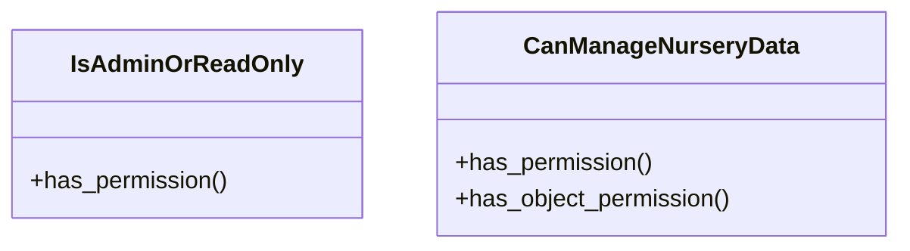

# agricultural_modules.nurseries.permissions

## Imports
- rest_framework

## Classes
- IsAdminOrReadOnly
  - method: `has_permission`
- CanManageNurseryData
  - method: `has_permission`
  - method: `has_object_permission`

## Functions
- has_permission
- has_permission
- has_object_permission

## Class Diagram

