# agricultural_modules.nurseries.serializers

## Imports
- django.contrib.auth.models
- models
- rest_framework

## Classes
- UserSerializer
- NurserySerializer
  - attr: `manager`
  - attr: `manager_id`
- NurserySectionSerializer
  - attr: `nursery`
  - attr: `nursery_id`
- PlantVarietySerializer
- GrowthStageSerializer
  - attr: `plant_variety`
  - attr: `plant_variety_id`
- ProductionBatchSerializer
  - attr: `plant_variety`
  - attr: `plant_variety_id`
  - attr: `nursery_section`
  - attr: `nursery_section_id`
  - attr: `current_growth_stage`
  - attr: `current_growth_stage_id`
- BatchStageLogSerializer
  - attr: `production_batch`
  - attr: `production_batch_id`
  - attr: `growth_stage`
  - attr: `growth_stage_id`
- NurseryActivityTypeSerializer
- ActivityResourceUsageSerializer
  - attr: `resource_id`
- NurseryActivitySerializer
  - attr: `activity_type`
  - attr: `activity_type_id`
  - attr: `production_batch`
  - attr: `production_batch_id`
  - attr: `nursery_section`
  - attr: `nursery_section_id`
  - attr: `performed_by`
  - attr: `performed_by_id`
  - attr: `resource_usages`
  - method: `create`
- NurseryResourceSerializer
- QualityCheckSerializer
  - attr: `production_batch`
  - attr: `production_batch_id`
  - attr: `checked_by`
  - attr: `checked_by_id`
- EnvironmentalLogSerializer
  - attr: `nursery_section`
  - attr: `nursery_section_id`
  - attr: `recorded_by`
  - attr: `recorded_by_id`
- Meta
  - attr: `model`
  - attr: `fields`
- Meta
  - attr: `model`
  - attr: `fields`
- Meta
  - attr: `model`
  - attr: `fields`
- Meta
  - attr: `model`
  - attr: `fields`
- Meta
  - attr: `model`
  - attr: `fields`
- Meta
  - attr: `model`
  - attr: `fields`
  - attr: `read_only_fields`
- Meta
  - attr: `model`
  - attr: `fields`
- Meta
  - attr: `model`
  - attr: `fields`
- Meta
  - attr: `model`
  - attr: `fields`
- Meta
  - attr: `model`
  - attr: `fields`
- Meta
  - attr: `model`
  - attr: `fields`
- Meta
  - attr: `model`
  - attr: `fields`
- Meta
  - attr: `model`
  - attr: `fields`

## Functions
- create

## Module Variables
- `PYTEST_DONT_REWRITE`

## Class Diagram

```mermaid
classDiagram
    class UserSerializer {
    }
    class NurserySerializer {
        +manager
        +manager_id
    }
    class NurserySectionSerializer {
        +nursery
        +nursery_id
    }
    class PlantVarietySerializer {
    }
    class GrowthStageSerializer {
        +plant_variety
        +plant_variety_id
    }
    class ProductionBatchSerializer {
        +plant_variety
        +plant_variety_id
        +nursery_section
        +nursery_section_id
        +current_growth_stage
        +... (1 more)
    }
    class BatchStageLogSerializer {
        +production_batch
        +production_batch_id
        +growth_stage
        +growth_stage_id
    }
    class NurseryActivityTypeSerializer {
    }
    class ActivityResourceUsageSerializer {
        +resource_id
    }
    class NurseryActivitySerializer {
        +activity_type
        +activity_type_id
        +production_batch
        +production_batch_id
        +nursery_section
        +... (4 more)
        +create()
    }
    class NurseryResourceSerializer {
    }
    class QualityCheckSerializer {
        +production_batch
        +production_batch_id
        +checked_by
        +checked_by_id
    }
    class EnvironmentalLogSerializer {
        +nursery_section
        +nursery_section_id
        +recorded_by
        +recorded_by_id
    }
    class Meta {
        +model
        +fields
    }
    class Meta {
        +model
        +fields
    }
    class Meta {
        +model
        +fields
    }
    class Meta {
        +model
        +fields
    }
    class Meta {
        +model
        +fields
    }
    class Meta {
        +model
        +fields
        +read_only_fields
    }
    class Meta {
        +model
        +fields
    }
    class Meta {
        +model
        +fields
    }
    class Meta {
        +model
        +fields
    }
    class Meta {
        +model
        +fields
    }
    class Meta {
        +model
        +fields
    }
    class Meta {
        +model
        +fields
    }
    class Meta {
        +model
        +fields
    }
    UserSerializer --> Meta
    UserSerializer --> Meta
    UserSerializer --> Meta
    UserSerializer --> Meta
    UserSerializer --> Meta
    UserSerializer --> Meta
    UserSerializer --> Meta
    UserSerializer --> Meta
    UserSerializer --> Meta
    UserSerializer --> Meta
    UserSerializer --> Meta
    UserSerializer --> Meta
    UserSerializer --> Meta
    NurserySerializer --> Meta
    NurserySerializer --> Meta
    NurserySerializer --> Meta
    NurserySerializer --> Meta
    NurserySerializer --> Meta
    NurserySerializer --> Meta
    NurserySerializer --> Meta
    NurserySerializer --> Meta
    NurserySerializer --> Meta
    NurserySerializer --> Meta
    NurserySerializer --> Meta
    NurserySerializer --> Meta
    NurserySerializer --> Meta
    NurserySectionSerializer --> Meta
    NurserySectionSerializer --> Meta
    NurserySectionSerializer --> Meta
    NurserySectionSerializer --> Meta
    NurserySectionSerializer --> Meta
    NurserySectionSerializer --> Meta
    NurserySectionSerializer --> Meta
    NurserySectionSerializer --> Meta
    NurserySectionSerializer --> Meta
    NurserySectionSerializer --> Meta
    NurserySectionSerializer --> Meta
    NurserySectionSerializer --> Meta
    NurserySectionSerializer --> Meta
    PlantVarietySerializer --> Meta
    PlantVarietySerializer --> Meta
    PlantVarietySerializer --> Meta
    PlantVarietySerializer --> Meta
    PlantVarietySerializer --> Meta
    PlantVarietySerializer --> Meta
    PlantVarietySerializer --> Meta
    PlantVarietySerializer --> Meta
    PlantVarietySerializer --> Meta
    PlantVarietySerializer --> Meta
    PlantVarietySerializer --> Meta
    PlantVarietySerializer --> Meta
    PlantVarietySerializer --> Meta
    GrowthStageSerializer --> Meta
    GrowthStageSerializer --> Meta
    GrowthStageSerializer --> Meta
    GrowthStageSerializer --> Meta
    GrowthStageSerializer --> Meta
    GrowthStageSerializer --> Meta
    GrowthStageSerializer --> Meta
    GrowthStageSerializer --> Meta
    GrowthStageSerializer --> Meta
    GrowthStageSerializer --> Meta
    GrowthStageSerializer --> Meta
    GrowthStageSerializer --> Meta
    GrowthStageSerializer --> Meta
    ProductionBatchSerializer --> Meta
    ProductionBatchSerializer --> Meta
    ProductionBatchSerializer --> Meta
    ProductionBatchSerializer --> Meta
    ProductionBatchSerializer --> Meta
    ProductionBatchSerializer --> Meta
    ProductionBatchSerializer --> Meta
    ProductionBatchSerializer --> Meta
    ProductionBatchSerializer --> Meta
    ProductionBatchSerializer --> Meta
    ProductionBatchSerializer --> Meta
    ProductionBatchSerializer --> Meta
    ProductionBatchSerializer --> Meta
    BatchStageLogSerializer --> Meta
    BatchStageLogSerializer --> Meta
    BatchStageLogSerializer --> Meta
    BatchStageLogSerializer --> Meta
    BatchStageLogSerializer --> Meta
    BatchStageLogSerializer --> Meta
    BatchStageLogSerializer --> Meta
    BatchStageLogSerializer --> Meta
    BatchStageLogSerializer --> Meta
    BatchStageLogSerializer --> Meta
    BatchStageLogSerializer --> Meta
    BatchStageLogSerializer --> Meta
    BatchStageLogSerializer --> Meta
    NurseryActivityTypeSerializer --> Meta
    NurseryActivityTypeSerializer --> Meta
    NurseryActivityTypeSerializer --> Meta
    NurseryActivityTypeSerializer --> Meta
    NurseryActivityTypeSerializer --> Meta
    NurseryActivityTypeSerializer --> Meta
    NurseryActivityTypeSerializer --> Meta
    NurseryActivityTypeSerializer --> Meta
    NurseryActivityTypeSerializer --> Meta
    NurseryActivityTypeSerializer --> Meta
    NurseryActivityTypeSerializer --> Meta
    NurseryActivityTypeSerializer --> Meta
    NurseryActivityTypeSerializer --> Meta
    ActivityResourceUsageSerializer --> Meta
    ActivityResourceUsageSerializer --> Meta
    ActivityResourceUsageSerializer --> Meta
    ActivityResourceUsageSerializer --> Meta
    ActivityResourceUsageSerializer --> Meta
    ActivityResourceUsageSerializer --> Meta
    ActivityResourceUsageSerializer --> Meta
    ActivityResourceUsageSerializer --> Meta
    ActivityResourceUsageSerializer --> Meta
    ActivityResourceUsageSerializer --> Meta
    ActivityResourceUsageSerializer --> Meta
    ActivityResourceUsageSerializer --> Meta
    ActivityResourceUsageSerializer --> Meta
    NurseryActivitySerializer --> Meta
    NurseryActivitySerializer --> Meta
    NurseryActivitySerializer --> Meta
    NurseryActivitySerializer --> Meta
    NurseryActivitySerializer --> Meta
    NurseryActivitySerializer --> Meta
    NurseryActivitySerializer --> Meta
    NurseryActivitySerializer --> Meta
    NurseryActivitySerializer --> Meta
    NurseryActivitySerializer --> Meta
    NurseryActivitySerializer --> Meta
    NurseryActivitySerializer --> Meta
    NurseryActivitySerializer --> Meta
    NurseryResourceSerializer --> Meta
    NurseryResourceSerializer --> Meta
    NurseryResourceSerializer --> Meta
    NurseryResourceSerializer --> Meta
    NurseryResourceSerializer --> Meta
    NurseryResourceSerializer --> Meta
    NurseryResourceSerializer --> Meta
    NurseryResourceSerializer --> Meta
    NurseryResourceSerializer --> Meta
    NurseryResourceSerializer --> Meta
    NurseryResourceSerializer --> Meta
    NurseryResourceSerializer --> Meta
    NurseryResourceSerializer --> Meta
    QualityCheckSerializer --> Meta
    QualityCheckSerializer --> Meta
    QualityCheckSerializer --> Meta
    QualityCheckSerializer --> Meta
    QualityCheckSerializer --> Meta
    QualityCheckSerializer --> Meta
    QualityCheckSerializer --> Meta
    QualityCheckSerializer --> Meta
    QualityCheckSerializer --> Meta
    QualityCheckSerializer --> Meta
    QualityCheckSerializer --> Meta
    QualityCheckSerializer --> Meta
    QualityCheckSerializer --> Meta
    EnvironmentalLogSerializer --> Meta
    EnvironmentalLogSerializer --> Meta
    EnvironmentalLogSerializer --> Meta
    EnvironmentalLogSerializer --> Meta
    EnvironmentalLogSerializer --> Meta
    EnvironmentalLogSerializer --> Meta
    EnvironmentalLogSerializer --> Meta
    EnvironmentalLogSerializer --> Meta
    EnvironmentalLogSerializer --> Meta
    EnvironmentalLogSerializer --> Meta
    EnvironmentalLogSerializer --> Meta
    EnvironmentalLogSerializer --> Meta
    EnvironmentalLogSerializer --> Meta
```

