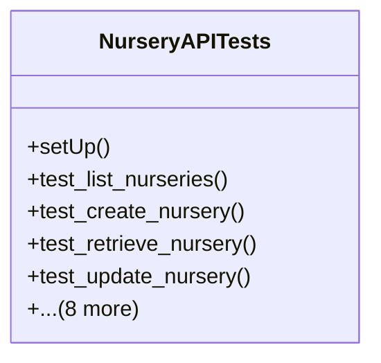

# agricultural_modules.nurseries.tests.test_api_views

## Imports
- decimal
- django.contrib.auth.models
- django.urls
- django.utils
- models
- rest_framework
- rest_framework.test
- serializers

## Classes
- NurseryAPITests
  - method: `setUp`
  - method: `test_list_nurseries`
  - method: `test_create_nursery`
  - method: `test_retrieve_nursery`
  - method: `test_update_nursery`
  - method: `test_delete_nursery`
  - method: `test_create_production_batch_api`
  - method: `test_advance_batch_stage_api`
  - method: `test_update_batch_quantity_api`
  - method: `test_get_batch_estimated_completion_api`
  - method: `test_create_nursery_activity_api`
  - method: `test_list_plant_varieties`
  - method: `test_create_plant_variety`

## Functions
- setUp
- test_list_nurseries
- test_create_nursery
- test_retrieve_nursery
- test_update_nursery
- test_delete_nursery
- test_create_production_batch_api
- test_advance_batch_stage_api
- test_update_batch_quantity_api
- test_get_batch_estimated_completion_api
- test_create_nursery_activity_api
- test_list_plant_varieties
- test_create_plant_variety

## Class Diagram

