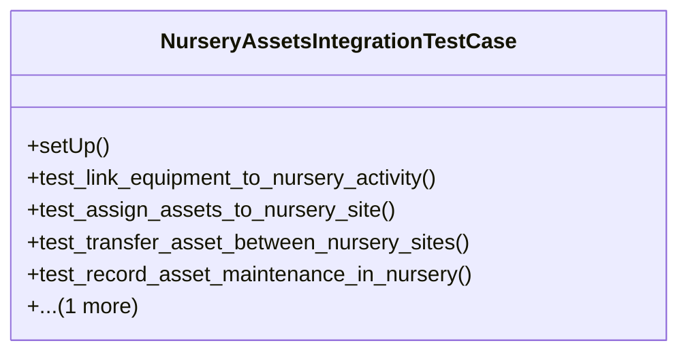

# agricultural_modules.nurseries.tests.test_assets_integration

## Imports
- agricultural_modules.nurseries.integration_assets
- agricultural_modules.nurseries.models
- business_modules.assets.models
- django.contrib.auth
- django.db
- django.test
- django.utils
- os
- sys

## Classes
- NurseryAssetsIntegrationTestCase
  - method: `setUp`
  - method: `test_link_equipment_to_nursery_activity`
  - method: `test_assign_assets_to_nursery_site`
  - method: `test_transfer_asset_between_nursery_sites`
  - method: `test_record_asset_maintenance_in_nursery`
  - method: `test_asset_disposal_handling`

## Functions
- setUp
- test_link_equipment_to_nursery_activity
- test_assign_assets_to_nursery_site
- test_transfer_asset_between_nursery_sites
- test_record_asset_maintenance_in_nursery
- test_asset_disposal_handling

## Module Variables
- `User`

## Class Diagram

