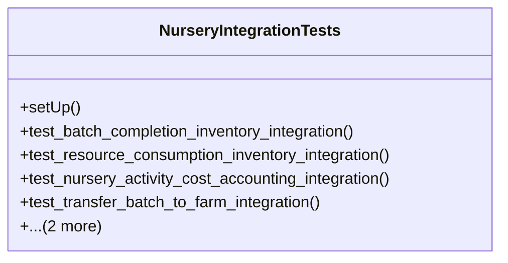

# agricultural_modules.nurseries.tests.test_integration

## Imports
- decimal
- django.contrib.auth.models
- django.test
- django.utils
- integration
- models
- services
- unittest.mock

## Classes
- NurseryIntegrationTests
  - method: `setUp`
  - method: `test_batch_completion_inventory_integration`
  - method: `test_resource_consumption_inventory_integration`
  - method: `test_nursery_activity_cost_accounting_integration`
  - method: `test_transfer_batch_to_farm_integration`
  - method: `test_quality_check_research_integration`
  - method: `test_batch_stage_log_research_integration`

## Functions
- setUp
- test_batch_completion_inventory_integration
- test_resource_consumption_inventory_integration
- test_nursery_activity_cost_accounting_integration
- test_transfer_batch_to_farm_integration
- test_quality_check_research_integration
- test_batch_stage_log_research_integration

## Class Diagram

