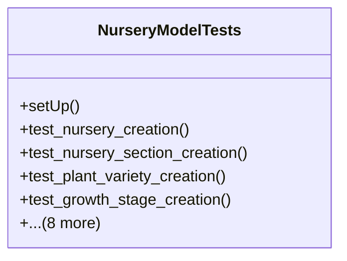

# agricultural_modules.nurseries.tests.test_models

## Imports
- decimal
- django.contrib.auth.models
- django.test
- django.utils
- models

## Classes
- NurseryModelTests
  - method: `setUp`
  - method: `test_nursery_creation`
  - method: `test_nursery_section_creation`
  - method: `test_plant_variety_creation`
  - method: `test_growth_stage_creation`
  - method: `test_production_batch_creation`
  - method: `test_batch_stage_log_creation`
  - method: `test_nursery_activity_type_creation`
  - method: `test_nursery_activity_creation`
  - method: `test_nursery_resource_creation`
  - method: `test_activity_resource_usage_creation`
  - method: `test_quality_check_creation`
  - method: `test_environmental_log_creation`

## Functions
- setUp
- test_nursery_creation
- test_nursery_section_creation
- test_plant_variety_creation
- test_growth_stage_creation
- test_production_batch_creation
- test_batch_stage_log_creation
- test_nursery_activity_type_creation
- test_nursery_activity_creation
- test_nursery_resource_creation
- test_activity_resource_usage_creation
- test_quality_check_creation
- test_environmental_log_creation

## Class Diagram

