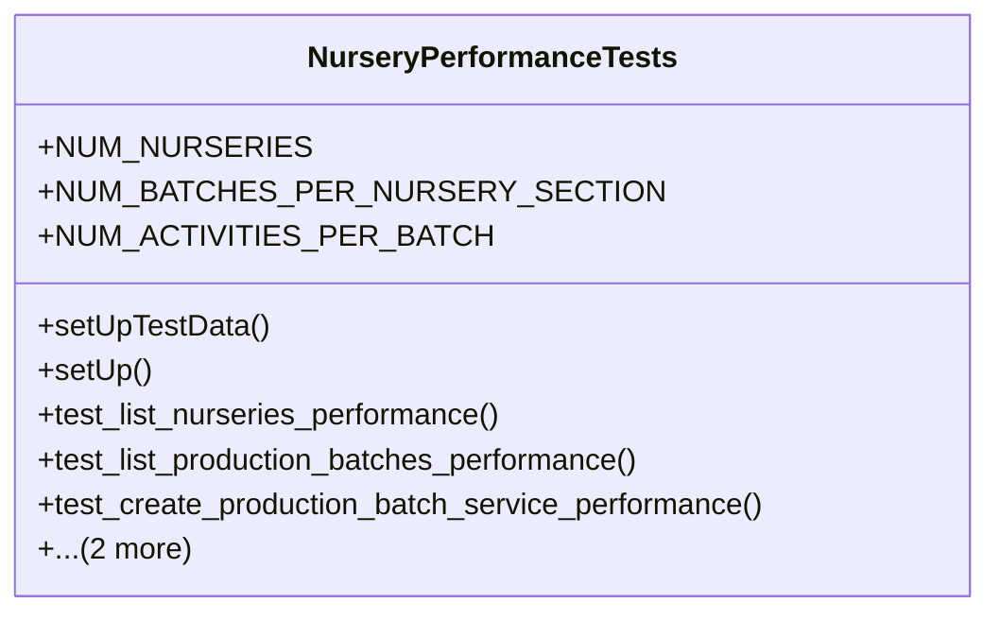

# agricultural_modules.nurseries.tests.test_performance

## Imports
- decimal
- django.contrib.auth.models
- django.urls
- django.utils
- models
- rest_framework
- rest_framework.test
- services
- time

## Classes
- NurseryPerformanceTests
  - attr: `NUM_NURSERIES`
  - attr: `NUM_BATCHES_PER_NURSERY_SECTION`
  - attr: `NUM_ACTIVITIES_PER_BATCH`
  - method: `setUpTestData`
  - method: `setUp`
  - method: `test_list_nurseries_performance`
  - method: `test_list_production_batches_performance`
  - method: `test_create_production_batch_service_performance`
  - method: `test_record_nursery_activity_api_performance`
  - method: `test_production_batch_filtering_performance`

## Functions
- setUpTestData
- setUp
- test_list_nurseries_performance
- test_list_production_batches_performance
- test_create_production_batch_service_performance
- test_record_nursery_activity_api_performance
- test_production_batch_filtering_performance

## Class Diagram

