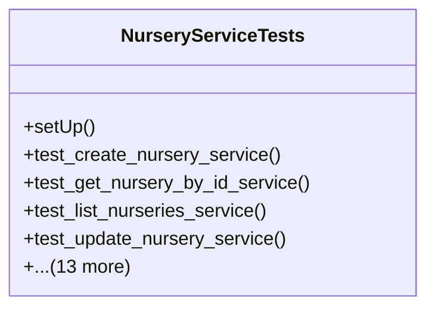

# agricultural_modules.nurseries.tests.test_services

## Imports
- decimal
- django.contrib.auth.models
- django.test
- django.utils
- models
- services

## Classes
- NurseryServiceTests
  - method: `setUp`
  - method: `test_create_nursery_service`
  - method: `test_get_nursery_by_id_service`
  - method: `test_list_nurseries_service`
  - method: `test_update_nursery_service`
  - method: `test_delete_nursery_service`
  - method: `test_create_nursery_section_service`
  - method: `test_create_production_batch_service`
  - method: `test_advance_batch_stage_service`
  - method: `test_update_batch_quantity_service`
  - method: `test_record_nursery_activity_service`
  - method: `test_record_quality_check_service`
  - method: `test_record_environmental_log_service`
  - method: `test_get_batch_estimated_completion_service`
  - method: `test_advance_batch_stage_invalid_transition`
  - method: `test_create_production_batch_no_section`
  - method: `test_record_nursery_activity_no_batch_or_section`
  - method: `test_record_nursery_activity_cost_calculation`

## Functions
- setUp
- test_create_nursery_service
- test_get_nursery_by_id_service
- test_list_nurseries_service
- test_update_nursery_service
- test_delete_nursery_service
- test_create_nursery_section_service
- test_create_production_batch_service
- test_advance_batch_stage_service
- test_update_batch_quantity_service
- test_record_nursery_activity_service
- test_record_quality_check_service
- test_record_environmental_log_service
- test_get_batch_estimated_completion_service
- test_advance_batch_stage_invalid_transition
- test_create_production_batch_no_section
- test_record_nursery_activity_no_batch_or_section
- test_record_nursery_activity_cost_calculation

## Class Diagram

