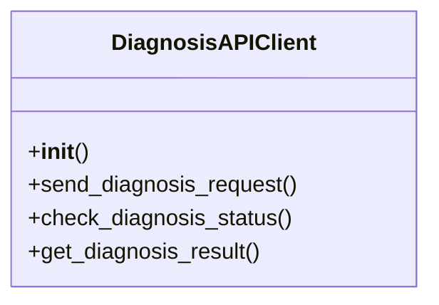

# agricultural_modules.plant_diagnosis.api_client

## Imports
- base64
- crypto
- django.conf
- json
- logging
- requests
- time

## Classes
- DiagnosisAPIClient
  - method: `__init__`
  - method: `send_diagnosis_request`
  - method: `check_diagnosis_status`
  - method: `get_diagnosis_result`

## Functions
- __init__
- send_diagnosis_request
- check_diagnosis_status
- get_diagnosis_result

## Module Variables
- `logger`

## Class Diagram

