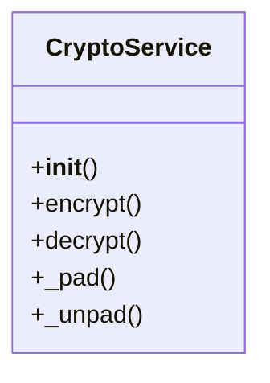

# agricultural_modules.plant_diagnosis.crypto

## Imports
- base64
- cryptography.hazmat.backends
- cryptography.hazmat.primitives.ciphers
- django.conf
- json
- logging
- os

## Classes
- CryptoService
  - method: `__init__`
  - method: `encrypt`
  - method: `decrypt`
  - method: `_pad`
  - method: `_unpad`

## Functions
- __init__
- encrypt
- decrypt
- _pad
- _unpad

## Module Variables
- `logger`

## Class Diagram

