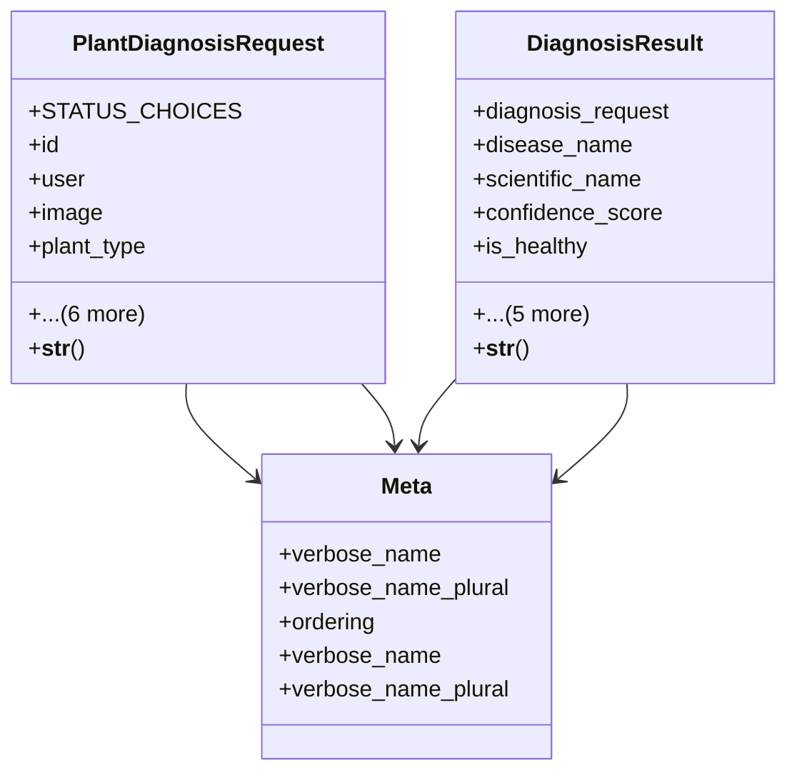

# agricultural_modules.plant_diagnosis.models

## Imports
- django.conf
- django.db
- django.utils.translation
- os
- uuid

## Classes
- PlantDiagnosisRequest
  - attr: `STATUS_CHOICES`
  - attr: `id`
  - attr: `user`
  - attr: `image`
  - attr: `plant_type`
  - attr: `symptoms_description`
  - attr: `location`
  - attr: `status`
  - attr: `created_at`
  - attr: `updated_at`
  - attr: `external_request_id`
  - method: `__str__`
- DiagnosisResult
  - attr: `diagnosis_request`
  - attr: `disease_name`
  - attr: `scientific_name`
  - attr: `confidence_score`
  - attr: `is_healthy`
  - attr: `description`
  - attr: `treatment`
  - attr: `prevention`
  - attr: `received_at`
  - attr: `additional_data`
  - method: `__str__`
- Meta
  - attr: `verbose_name`
  - attr: `verbose_name_plural`
  - attr: `ordering`
- Meta
  - attr: `verbose_name`
  - attr: `verbose_name_plural`

## Functions
- plant_image_upload_path
- __str__
- __str__

## Class Diagram

