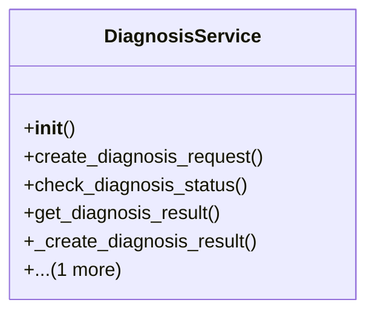

# agricultural_modules.plant_diagnosis.services

## Imports
- api_client
- django.conf
- django.db
- logging
- models
- os

## Classes
- DiagnosisService
  - method: `__init__`
  - method: `create_diagnosis_request`
  - method: `check_diagnosis_status`
  - method: `get_diagnosis_result`
  - method: `_create_diagnosis_result`
  - method: `_update_diagnosis_result`

## Functions
- __init__
- create_diagnosis_request
- check_diagnosis_status
- get_diagnosis_result
- _create_diagnosis_result
- _update_diagnosis_result

## Module Variables
- `logger`

## Class Diagram

