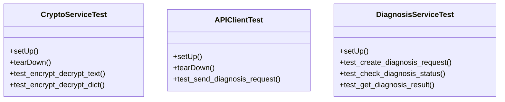

# agricultural_modules.plant_diagnosis.tests.test_integration

## Imports
- agricultural_modules.plant_diagnosis.api_client
- agricultural_modules.plant_diagnosis.crypto
- agricultural_modules.plant_diagnosis.models
- agricultural_modules.plant_diagnosis.services
- base64
- django.conf
- django.contrib.auth
- django.core.files.uploadedfile
- django.test
- json
- os
- tempfile
- unittest
- unittest.mock

## Classes
- CryptoServiceTest
  - method: `setUp`
  - method: `tearDown`
  - method: `test_encrypt_decrypt_text`
  - method: `test_encrypt_decrypt_dict`
- APIClientTest
  - method: `setUp`
  - method: `tearDown`
  - method: `test_send_diagnosis_request`
- DiagnosisServiceTest
  - method: `setUp`
  - method: `test_create_diagnosis_request`
  - method: `test_check_diagnosis_status`
  - method: `test_get_diagnosis_result`

## Functions
- setUp
- tearDown
- test_encrypt_decrypt_text
- test_encrypt_decrypt_dict
- setUp
- tearDown
- test_send_diagnosis_request
- setUp
- test_create_diagnosis_request
- test_check_diagnosis_status
- test_get_diagnosis_result

## Module Variables
- `User`

## Class Diagram

