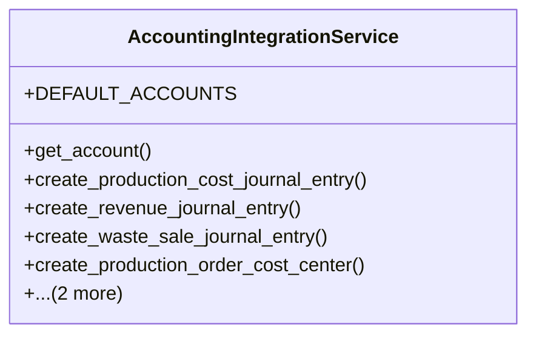

# agricultural_modules.production._accounting_integration_impl

## Imports
- __future__
- accounting
- decimal
- django.db
- production
- typing

## Classes
- AccountingIntegrationService
  - attr: `DEFAULT_ACCOUNTS`
  - method: `get_account`
  - method: `create_production_cost_journal_entry`
  - method: `create_revenue_journal_entry`
  - method: `create_waste_sale_journal_entry`
  - method: `create_production_order_cost_center`
  - method: `create_production_batch_inventory_entry`
  - method: `update_profit_loss_report`

## Functions
- get_account
- create_production_cost_journal_entry
- create_revenue_journal_entry
- create_waste_sale_journal_entry
- create_production_order_cost_center
- create_production_batch_inventory_entry
- update_profit_loss_report

## Class Diagram

