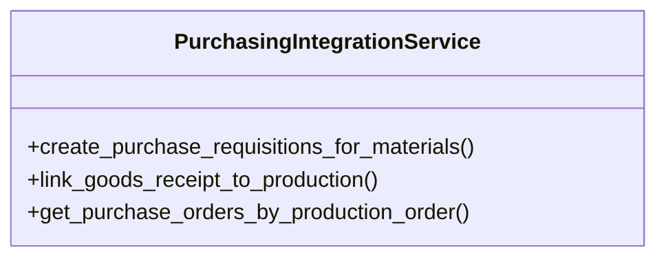

# agricultural_modules.production._purchasing_integration_impl

## Imports
- __future__
- decimal
- django.db
- logging
- purchasing
- typing

## Classes
- PurchasingIntegrationService
  - method: `create_purchase_requisitions_for_materials`
  - method: `link_goods_receipt_to_production`
  - method: `get_purchase_orders_by_production_order`

## Functions
- create_purchase_requisitions_for_materials
- link_goods_receipt_to_production
- get_purchase_orders_by_production_order

## Module Variables
- `logger`

## Class Diagram

