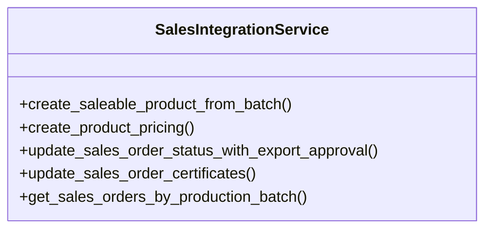

# agricultural_modules.production._sales_integration_impl

## Imports
- __future__
- datetime
- decimal
- django.db
- django.utils
- logging
- sales
- typing

## Classes
- SalesIntegrationService
  - method: `create_saleable_product_from_batch`
  - method: `create_product_pricing`
  - method: `update_sales_order_status_with_export_approval`
  - method: `update_sales_order_certificates`
  - method: `get_sales_orders_by_production_batch`

## Functions
- create_saleable_product_from_batch
- create_product_pricing
- update_sales_order_status_with_export_approval
- update_sales_order_certificates
- get_sales_orders_by_production_batch

## Module Variables
- `logger`

## Class Diagram

