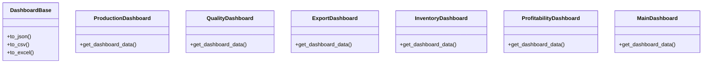

# agricultural_modules.production.analytics._dashboards_impl

## Imports
- __future__
- csv
- io
- json
- pandas
- typing

## Classes
- DashboardBase
  - method: `to_json`
  - method: `to_csv`
  - method: `to_excel`
- ProductionDashboard
  - method: `get_dashboard_data`
- QualityDashboard
  - method: `get_dashboard_data`
- ExportDashboard
  - method: `get_dashboard_data`
- InventoryDashboard
  - method: `get_dashboard_data`
- ProfitabilityDashboard
  - method: `get_dashboard_data`
- MainDashboard
  - method: `get_dashboard_data`

## Functions
- to_json
- to_csv
- to_excel
- get_dashboard_data
- get_dashboard_data
- get_dashboard_data
- get_dashboard_data
- get_dashboard_data
- get_dashboard_data

## Class Diagram

