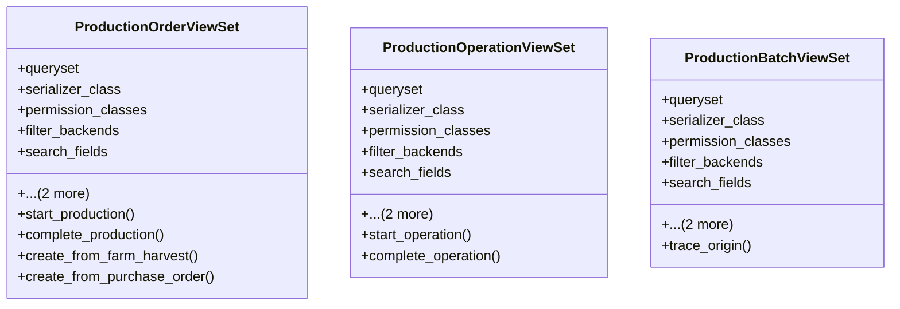

# agricultural_modules.production.api_views

## Imports
- certificates_models
- change_tracking
- django.db
- django.utils
- django.utils.translation
- export_approval_models
- farms.models
- food_safety_models
- integration_services
- inventory.models
- models
- purchasing.models
- rest_framework
- rest_framework.decorators
- rest_framework.response
- serializers
- supplier_integration

## Classes
- ProductionOrderViewSet
  - attr: `queryset`
  - attr: `serializer_class`
  - attr: `permission_classes`
  - attr: `filter_backends`
  - attr: `search_fields`
  - attr: `ordering_fields`
  - attr: `ordering`
  - method: `start_production`
  - method: `complete_production`
  - method: `create_from_farm_harvest`
  - method: `create_from_purchase_order`
- ProductionOperationViewSet
  - attr: `queryset`
  - attr: `serializer_class`
  - attr: `permission_classes`
  - attr: `filter_backends`
  - attr: `search_fields`
  - attr: `ordering_fields`
  - attr: `ordering`
  - method: `start_operation`
  - method: `complete_operation`
- ProductionBatchViewSet
  - attr: `queryset`
  - attr: `serializer_class`
  - attr: `permission_classes`
  - attr: `filter_backends`
  - attr: `search_fields`
  - attr: `ordering_fields`
  - attr: `ordering`
  - method: `trace_origin`

## Functions
- start_production
- complete_production
- create_from_farm_harvest
- create_from_purchase_order
- start_operation
- complete_operation
- trace_origin

## Class Diagram

