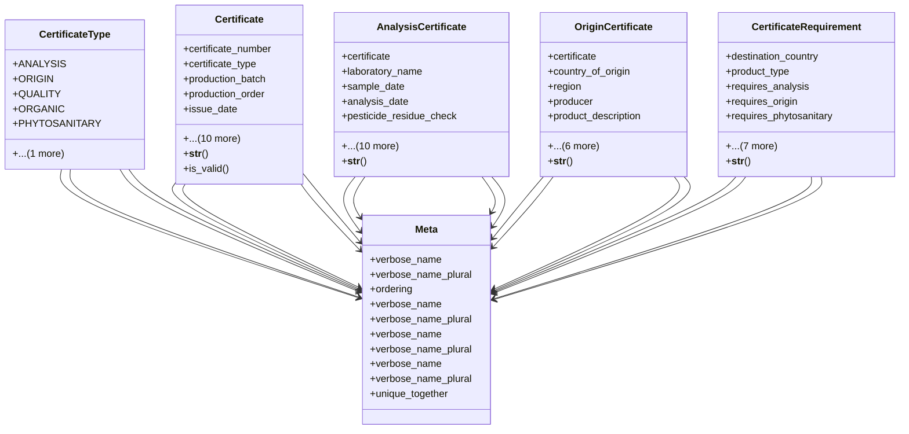

# agricultural_modules.production.certificates_models

## Imports
- django.contrib.auth.models
- django.core.validators
- django.db
- django.utils
- django.utils.translation
- export_approval_models
- models

## Classes
- CertificateType
  - attr: `ANALYSIS`
  - attr: `ORIGIN`
  - attr: `QUALITY`
  - attr: `ORGANIC`
  - attr: `PHYTOSANITARY`
  - attr: `OTHER`
- Certificate
  - attr: `certificate_number`
  - attr: `certificate_type`
  - attr: `production_batch`
  - attr: `production_order`
  - attr: `issue_date`
  - attr: `expiry_date`
  - attr: `issuing_authority`
  - attr: `status`
  - attr: `description`
  - attr: `notes`
  - attr: `file`
  - attr: `created_by`
  - attr: `created_at`
  - attr: `updated_by`
  - attr: `updated_at`
  - method: `__str__`
  - method: `is_valid`
- AnalysisCertificate
  - attr: `certificate`
  - attr: `laboratory_name`
  - attr: `sample_date`
  - attr: `analysis_date`
  - attr: `pesticide_residue_check`
  - attr: `pesticide_residue_results`
  - attr: `heavy_metals_check`
  - attr: `heavy_metals_results`
  - attr: `microbial_check`
  - attr: `microbial_results`
  - attr: `nutritional_check`
  - attr: `nutritional_results`
  - attr: `other_checks`
  - attr: `passed`
  - attr: `recommendations`
  - method: `__str__`
- OriginCertificate
  - attr: `certificate`
  - attr: `country_of_origin`
  - attr: `region`
  - attr: `producer`
  - attr: `product_description`
  - attr: `hs_code`
  - attr: `exporter`
  - attr: `importer`
  - attr: `destination_country`
  - attr: `transport_details`
  - attr: `packaging_details`
  - method: `__str__`
- CertificateRequirement
  - attr: `destination_country`
  - attr: `product_type`
  - attr: `requires_analysis`
  - attr: `requires_origin`
  - attr: `requires_phytosanitary`
  - attr: `requires_quality`
  - attr: `requires_organic`
  - attr: `special_requirements`
  - attr: `created_by`
  - attr: `created_at`
  - attr: `updated_by`
  - attr: `updated_at`
  - method: `__str__`
- Meta
  - attr: `verbose_name`
  - attr: `verbose_name_plural`
  - attr: `ordering`
- Meta
  - attr: `verbose_name`
  - attr: `verbose_name_plural`
- Meta
  - attr: `verbose_name`
  - attr: `verbose_name_plural`
- Meta
  - attr: `verbose_name`
  - attr: `verbose_name_plural`
  - attr: `unique_together`

## Functions
- __str__
- is_valid
- __str__
- __str__
- __str__

## Class Diagram

