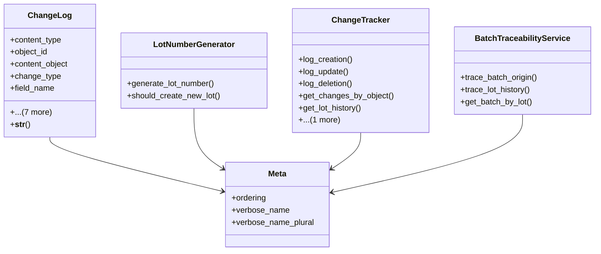

# agricultural_modules.production.change_tracking

## Imports
- django.contrib.auth.models
- django.contrib.contenttypes.fields
- django.contrib.contenttypes.models
- django.db
- django.utils
- django.utils.translation
- models

## Classes
- ChangeLog
  - attr: `content_type`
  - attr: `object_id`
  - attr: `content_object`
  - attr: `change_type`
  - attr: `field_name`
  - attr: `old_value`
  - attr: `new_value`
  - attr: `change_date`
  - attr: `changed_by`
  - attr: `change_reason`
  - attr: `lot_number`
  - attr: `new_lot_created`
  - method: `__str__`
- LotNumberGenerator
  - method: `generate_lot_number`
  - method: `should_create_new_lot`
- ChangeTracker
  - method: `log_creation`
  - method: `log_update`
  - method: `log_deletion`
  - method: `get_changes_by_object`
  - method: `get_lot_history`
  - method: `get_new_lots_created`
- BatchTraceabilityService
  - method: `trace_batch_origin`
  - method: `trace_lot_history`
  - method: `get_batch_by_lot`
- Meta
  - attr: `ordering`
  - attr: `verbose_name`
  - attr: `verbose_name_plural`

## Functions
- __str__
- generate_lot_number
- should_create_new_lot
- log_creation
- log_update
- log_deletion
- get_changes_by_object
- get_lot_history
- get_new_lots_created
- trace_batch_origin
- trace_lot_history
- get_batch_by_lot

## Class Diagram

