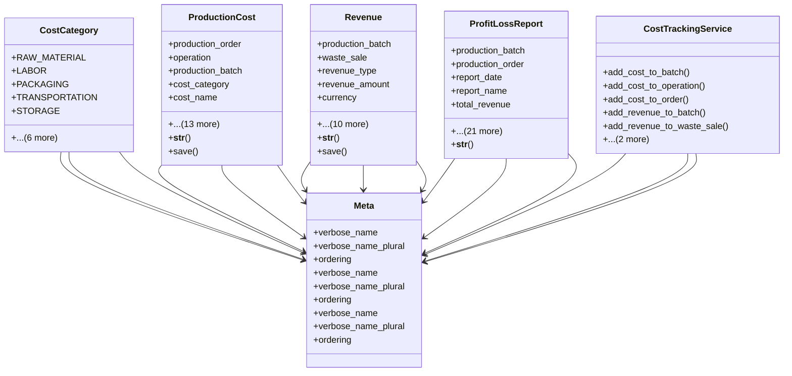

# agricultural_modules.production.cost_tracking

## Imports
- decimal
- django.contrib.auth.models
- django.core.validators
- django.db
- django.utils
- django.utils.translation
- models

## Classes
- CostCategory
  - attr: `RAW_MATERIAL`
  - attr: `LABOR`
  - attr: `PACKAGING`
  - attr: `TRANSPORTATION`
  - attr: `STORAGE`
  - attr: `CERTIFICATION`
  - attr: `CUSTOMS`
  - attr: `UTILITIES`
  - attr: `EQUIPMENT`
  - attr: `WASTE_MANAGEMENT`
  - attr: `OTHER`
- ProductionCost
  - attr: `production_order`
  - attr: `operation`
  - attr: `production_batch`
  - attr: `cost_category`
  - attr: `cost_name`
  - attr: `cost_amount`
  - attr: `currency`
  - attr: `quantity`
  - attr: `unit`
  - attr: `unit_cost`
  - attr: `cost_date`
  - attr: `is_direct`
  - attr: `is_fixed`
  - attr: `notes`
  - attr: `created_by`
  - attr: `created_at`
  - attr: `updated_by`
  - attr: `updated_at`
  - method: `__str__`
  - method: `save`
- Revenue
  - attr: `production_batch`
  - attr: `waste_sale`
  - attr: `revenue_type`
  - attr: `revenue_amount`
  - attr: `currency`
  - attr: `quantity`
  - attr: `unit`
  - attr: `unit_price`
  - attr: `revenue_date`
  - attr: `customer`
  - attr: `notes`
  - attr: `created_by`
  - attr: `created_at`
  - attr: `updated_by`
  - attr: `updated_at`
  - method: `__str__`
  - method: `save`
- ProfitLossReport
  - attr: `production_batch`
  - attr: `production_order`
  - attr: `report_date`
  - attr: `report_name`
  - attr: `total_revenue`
  - attr: `main_product_revenue`
  - attr: `waste_revenue`
  - attr: `other_revenue`
  - attr: `total_cost`
  - attr: `direct_cost`
  - attr: `indirect_cost`
  - attr: `raw_material_cost`
  - attr: `labor_cost`
  - attr: `packaging_cost`
  - attr: `transportation_cost`
  - attr: `certification_cost`
  - attr: `other_cost`
  - attr: `gross_profit`
  - attr: `net_profit`
  - attr: `profit_margin`
  - attr: `currency`
  - attr: `notes`
  - attr: `created_by`
  - attr: `created_at`
  - attr: `updated_by`
  - attr: `updated_at`
  - method: `__str__`
- CostTrackingService
  - method: `add_cost_to_batch`
  - method: `add_cost_to_operation`
  - method: `add_cost_to_order`
  - method: `add_revenue_to_batch`
  - method: `add_revenue_to_waste_sale`
  - method: `generate_profit_loss_report_for_batch`
  - method: `generate_profit_loss_report_for_order`
- Meta
  - attr: `verbose_name`
  - attr: `verbose_name_plural`
  - attr: `ordering`
- Meta
  - attr: `verbose_name`
  - attr: `verbose_name_plural`
  - attr: `ordering`
- Meta
  - attr: `verbose_name`
  - attr: `verbose_name_plural`
  - attr: `ordering`

## Functions
- __str__
- save
- __str__
- save
- __str__
- add_cost_to_batch
- add_cost_to_operation
- add_cost_to_order
- add_revenue_to_batch
- add_revenue_to_waste_sale
- generate_profit_loss_report_for_batch
- generate_profit_loss_report_for_order

## Class Diagram

