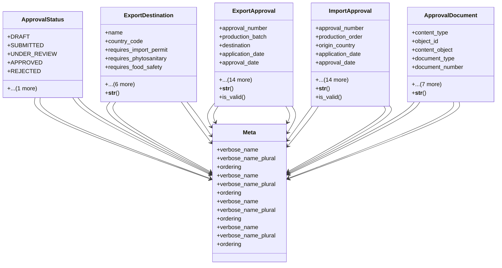

# agricultural_modules.production.export_approval_models

## Imports
- django.contrib.auth.models
- django.core.validators
- django.db
- django.utils
- django.utils.translation
- models

## Classes
- ApprovalStatus
  - attr: `DRAFT`
  - attr: `SUBMITTED`
  - attr: `UNDER_REVIEW`
  - attr: `APPROVED`
  - attr: `REJECTED`
  - attr: `EXPIRED`
- ExportDestination
  - attr: `name`
  - attr: `country_code`
  - attr: `requires_import_permit`
  - attr: `requires_phytosanitary`
  - attr: `requires_food_safety`
  - attr: `special_requirements`
  - attr: `active`
  - attr: `created_by`
  - attr: `created_at`
  - attr: `updated_by`
  - attr: `updated_at`
  - method: `__str__`
- ExportApproval
  - attr: `approval_number`
  - attr: `production_batch`
  - attr: `destination`
  - attr: `application_date`
  - attr: `approval_date`
  - attr: `expiry_date`
  - attr: `status`
  - attr: `notes`
  - attr: `expected_shipping_date`
  - attr: `actual_shipping_date`
  - attr: `shipping_method`
  - attr: `has_phytosanitary_certificate`
  - attr: `has_food_safety_approval`
  - attr: `has_import_permit`
  - attr: `has_export_declaration`
  - attr: `created_by`
  - attr: `created_at`
  - attr: `updated_by`
  - attr: `updated_at`
  - method: `__str__`
  - method: `is_valid`
- ImportApproval
  - attr: `approval_number`
  - attr: `production_order`
  - attr: `origin_country`
  - attr: `application_date`
  - attr: `approval_date`
  - attr: `expiry_date`
  - attr: `status`
  - attr: `notes`
  - attr: `expected_arrival_date`
  - attr: `actual_arrival_date`
  - attr: `shipping_method`
  - attr: `has_phytosanitary_certificate`
  - attr: `has_origin_certificate`
  - attr: `has_import_permit`
  - attr: `has_customs_declaration`
  - attr: `created_by`
  - attr: `created_at`
  - attr: `updated_by`
  - attr: `updated_at`
  - method: `__str__`
  - method: `is_valid`
- ApprovalDocument
  - attr: `content_type`
  - attr: `object_id`
  - attr: `content_object`
  - attr: `document_type`
  - attr: `document_number`
  - attr: `issue_date`
  - attr: `expiry_date`
  - attr: `issuing_authority`
  - attr: `file`
  - attr: `notes`
  - attr: `created_by`
  - attr: `created_at`
  - method: `__str__`
- Meta
  - attr: `verbose_name`
  - attr: `verbose_name_plural`
  - attr: `ordering`
- Meta
  - attr: `verbose_name`
  - attr: `verbose_name_plural`
  - attr: `ordering`
- Meta
  - attr: `verbose_name`
  - attr: `verbose_name_plural`
  - attr: `ordering`
- Meta
  - attr: `verbose_name`
  - attr: `verbose_name_plural`
  - attr: `ordering`

## Functions
- __str__
- __str__
- is_valid
- __str__
- is_valid
- __str__

## Class Diagram

