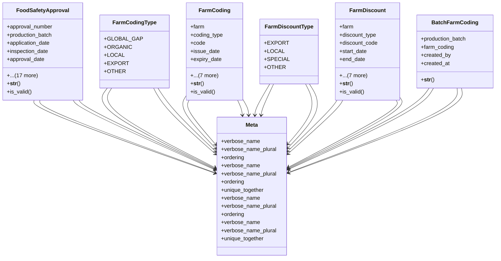

# agricultural_modules.production.food_safety_models

## Imports
- django.contrib.auth.models
- django.core.validators
- django.db
- django.utils
- django.utils.translation
- export_approval_models
- models

## Classes
- FoodSafetyApproval
  - attr: `approval_number`
  - attr: `production_batch`
  - attr: `application_date`
  - attr: `inspection_date`
  - attr: `approval_date`
  - attr: `expiry_date`
  - attr: `status`
  - attr: `notes`
  - attr: `inspector_name`
  - attr: `inspection_location`
  - attr: `sample_taken`
  - attr: `sample_results`
  - attr: `pesticide_residue_check`
  - attr: `pesticide_residue_results`
  - attr: `heavy_metals_check`
  - attr: `heavy_metals_results`
  - attr: `microbial_check`
  - attr: `microbial_results`
  - attr: `created_by`
  - attr: `created_at`
  - attr: `updated_by`
  - attr: `updated_at`
  - method: `__str__`
  - method: `is_valid`
- FarmCodingType
  - attr: `GLOBAL_GAP`
  - attr: `ORGANIC`
  - attr: `LOCAL`
  - attr: `EXPORT`
  - attr: `OTHER`
- FarmCoding
  - attr: `farm`
  - attr: `coding_type`
  - attr: `code`
  - attr: `issue_date`
  - attr: `expiry_date`
  - attr: `issuing_authority`
  - attr: `status`
  - attr: `notes`
  - attr: `created_by`
  - attr: `created_at`
  - attr: `updated_by`
  - attr: `updated_at`
  - method: `__str__`
  - method: `is_valid`
- FarmDiscountType
  - attr: `EXPORT`
  - attr: `LOCAL`
  - attr: `SPECIAL`
  - attr: `OTHER`
- FarmDiscount
  - attr: `farm`
  - attr: `discount_type`
  - attr: `discount_code`
  - attr: `start_date`
  - attr: `end_date`
  - attr: `discount_percentage`
  - attr: `discount_amount`
  - attr: `notes`
  - attr: `created_by`
  - attr: `created_at`
  - attr: `updated_by`
  - attr: `updated_at`
  - method: `__str__`
  - method: `is_valid`
- BatchFarmCoding
  - attr: `production_batch`
  - attr: `farm_coding`
  - attr: `created_by`
  - attr: `created_at`
  - method: `__str__`
- Meta
  - attr: `verbose_name`
  - attr: `verbose_name_plural`
  - attr: `ordering`
- Meta
  - attr: `verbose_name`
  - attr: `verbose_name_plural`
  - attr: `ordering`
  - attr: `unique_together`
- Meta
  - attr: `verbose_name`
  - attr: `verbose_name_plural`
  - attr: `ordering`
- Meta
  - attr: `verbose_name`
  - attr: `verbose_name_plural`
  - attr: `unique_together`

## Functions
- __str__
- is_valid
- __str__
- is_valid
- __str__
- is_valid
- __str__

## Class Diagram

