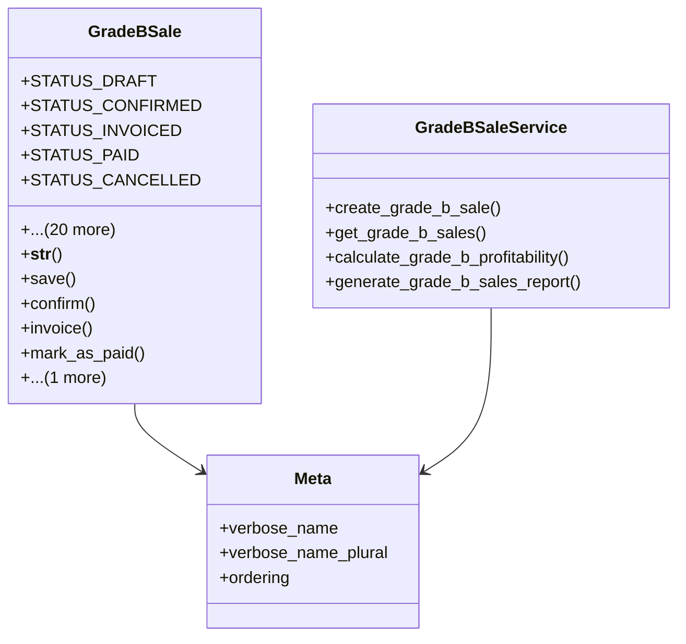

# agricultural_modules.production.grade_b_sales

## Imports
- business_modules.partners.models
- django.conf
- django.core.exceptions
- django.db
- django.db.models
- django.utils
- django.utils.translation
- models
- product_grading.models
- workflow.models

## Classes
- GradeBSale
  - attr: `STATUS_DRAFT`
  - attr: `STATUS_CONFIRMED`
  - attr: `STATUS_INVOICED`
  - attr: `STATUS_PAID`
  - attr: `STATUS_CANCELLED`
  - attr: `STATUS_CHOICES`
  - attr: `sale_number`
  - attr: `product`
  - attr: `production_batch`
  - attr: `workflow_execution`
  - attr: `stage_execution`
  - attr: `quantity`
  - attr: `unit`
  - attr: `unit_price`
  - attr: `total_price`
  - attr: `customer`
  - attr: `sale_date`
  - attr: `invoice_number`
  - attr: `invoice_date`
  - attr: `status`
  - attr: `notes`
  - attr: `created_by`
  - attr: `created_at`
  - attr: `updated_by`
  - attr: `updated_at`
  - method: `__str__`
  - method: `save`
  - method: `confirm`
  - method: `invoice`
  - method: `mark_as_paid`
  - method: `cancel`
- GradeBSaleService
  - method: `create_grade_b_sale`
  - method: `get_grade_b_sales`
  - method: `calculate_grade_b_profitability`
  - method: `generate_grade_b_sales_report`
- Meta
  - attr: `verbose_name`
  - attr: `verbose_name_plural`
  - attr: `ordering`

## Functions
- __str__
- save
- confirm
- invoice
- mark_as_paid
- cancel
- create_grade_b_sale
- get_grade_b_sales
- calculate_grade_b_profitability
- generate_grade_b_sales_report

## Class Diagram

