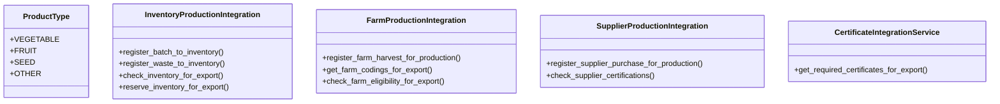

# agricultural_modules.production.integration_services

## Imports
- certificates_models
- django.contrib.auth.models
- django.db
- django.db.models
- django.utils
- django.utils.translation
- export_approval_models
- farms.models
- food_safety_models
- inventory.models
- models
- purchasing.models

## Classes
- ProductType
  - attr: `VEGETABLE`
  - attr: `FRUIT`
  - attr: `SEED`
  - attr: `OTHER`
- InventoryProductionIntegration
  - method: `register_batch_to_inventory`
  - method: `register_waste_to_inventory`
  - method: `check_inventory_for_export`
  - method: `reserve_inventory_for_export`
- FarmProductionIntegration
  - method: `register_farm_harvest_for_production`
  - method: `get_farm_codings_for_export`
  - method: `check_farm_eligibility_for_export`
- SupplierProductionIntegration
  - method: `register_supplier_purchase_for_production`
  - method: `check_supplier_certifications`
- CertificateIntegrationService
  - method: `get_required_certificates_for_export`

## Functions
- register_batch_to_inventory
- register_waste_to_inventory
- check_inventory_for_export
- reserve_inventory_for_export
- register_farm_harvest_for_production
- get_farm_codings_for_export
- check_farm_eligibility_for_export
- register_supplier_purchase_for_production
- check_supplier_certifications
- get_required_certificates_for_export

## Class Diagram

