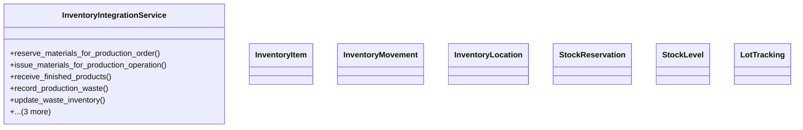

# agricultural_modules.production.inventory_integration

## Imports
- decimal
- django.db
- django.db.models.signals
- django.dispatch
- django.utils
- inventory.models
- logging

## Classes
- InventoryIntegrationService
  - method: `reserve_materials_for_production_order`
  - method: `issue_materials_for_production_operation`
  - method: `receive_finished_products`
  - method: `record_production_waste`
  - method: `update_waste_inventory`
  - method: `release_reserved_materials`
  - method: `check_material_availability`
  - method: `get_inventory_movements_by_production`
- InventoryItem
- InventoryMovement
- InventoryLocation
- StockReservation
- StockLevel
- LotTracking

## Functions
- reserve_materials_for_production_order
- issue_materials_for_production_operation
- receive_finished_products
- record_production_waste
- update_waste_inventory
- release_reserved_materials
- check_material_availability
- get_inventory_movements_by_production

## Module Variables
- `logger`

## Class Diagram

