# agricultural_modules.production.models

## Imports
- certificates_models
- cost_tracking
- django.conf
- django.core.validators
- django.db
- django.utils.translation
- export_approval_models
- food_safety_models

## Classes
- ProductionSource
  - attr: `INTERNAL`
  - attr: `EXTERNAL`
  - attr: `MIXED`
- ProductType
  - attr: `SEED`
  - attr: `VEGETABLE`
  - attr: `FRUIT`
  - attr: `OTHER`
- ProductionOrderStatus
  - attr: `DRAFT`
  - attr: `CONFIRMED`
  - attr: `IN_PROGRESS`
  - attr: `COMPLETED`
  - attr: `CANCELLED`
- OperationType
  - attr: `SEED_SORTING`
  - attr: `SEED_DRYING`
  - attr: `SEED_CLEANING`
  - attr: `SEED_TREATMENT`
  - attr: `SEED_TESTING`
  - attr: `SEED_PACKAGING`
  - attr: `SEED_LABELING`
  - attr: `INITIAL_SORTING`
  - attr: `MANUAL_SORTING`
  - attr: `MECHANICAL_SORTING`
  - attr: `WASHING`
  - attr: `PACKAGING`
  - attr: `REFRIGERATION`
  - attr: `FREEZING`
  - attr: `PALLETIZING`
  - attr: `QUALITY_CONTROL`
- ProductGrade
  - attr: `PREMIUM`
  - attr: `GRADE_1`
  - attr: `GRADE_1_5`
  - attr: `GRADE_2`
  - attr: `GRADE_3`
  - attr: `SORTING`
- ProductionOrder
  - attr: `order_number`
  - attr: `product_type`
  - attr: `product`
  - attr: `source`
  - attr: `supplier_name`
  - attr: `farm`
  - attr: `seed_production_batch_id`
  - attr: `planned_start_date`
  - attr: `actual_start_date`
  - attr: `planned_end_date`
  - attr: `actual_end_date`
  - attr: `input_quantity`
  - attr: `input_unit`
  - attr: `expected_output_quantity`
  - attr: `actual_output_quantity`
  - attr: `output_unit`
  - attr: `status`
  - attr: `notes`
  - attr: `created_by`
  - attr: `created_at`
  - attr: `updated_by`
  - attr: `updated_at`
  - method: `__str__`
  - method: `calculate_waste_percentage`
  - method: `calculate_profit`
  - method: `calculate_total_cost`
  - method: `get_input_unit_cost`
- ProductionOperation
  - attr: `production_order`
  - attr: `operation_type`
  - attr: `sequence`
  - attr: `planned_start_date`
  - attr: `actual_start_date`
  - attr: `planned_end_date`
  - attr: `actual_end_date`
  - attr: `input_quantity`
  - attr: `output_quantity`
  - attr: `waste_quantity`
  - attr: `status`
  - attr: `notes`
  - attr: `responsible`
  - attr: `created_by`
  - attr: `created_at`
  - attr: `updated_by`
  - attr: `updated_at`
  - method: `__str__`
  - method: `calculate_waste_percentage`
  - method: `calculate_cost`
- OperationLaborCost
  - attr: `operation`
  - attr: `employee_name`
  - attr: `hours`
  - attr: `hourly_rate`
  - attr: `cost`
  - method: `save`
- OperationEquipmentCost
  - attr: `operation`
  - attr: `equipment_name`
  - attr: `hours`
  - attr: `hourly_rate`
  - attr: `cost`
  - method: `save`
- OperationMaterialCost
  - attr: `operation`
  - attr: `material_name`
  - attr: `quantity`
  - attr: `unit_cost`
  - attr: `cost`
  - method: `save`
- RawMaterial
  - attr: `code`
  - attr: `name`
  - attr: `unit`
- ProductionBatch
  - attr: `production_order`
  - attr: `batch_number`
  - attr: `lot_number`
  - attr: `product`
  - attr: `grade`
  - attr: `quantity`
  - attr: `unit`
  - attr: `status`
  - attr: `completion_date`
  - attr: `expiry_date`
  - attr: `created_by`
  - attr: `created_at`
  - attr: `updated_by`
  - attr: `updated_at`
  - method: `__str__`
- ProductionWaste
  - attr: `production_operation`
  - attr: `product`
  - attr: `waste_type`
  - attr: `quantity`
  - attr: `unit`
  - attr: `created_by`
  - attr: `created_at`
- MaterialRequirement
  - attr: `production_order`
  - attr: `material`
  - attr: `quantity`
  - attr: `unit`
  - attr: `lot_number`
  - attr: `batch_number`
  - attr: `created_by`
  - attr: `created_at`
- WasteSale
  - attr: `production_batch`
  - attr: `waste_type`
  - attr: `quantity`
  - attr: `unit`
  - attr: `unit_price`
  - attr: `total_value`
  - attr: `sale_date`
- Meta
  - attr: `verbose_name`
  - attr: `verbose_name_plural`
  - attr: `ordering`
- Meta
  - attr: `verbose_name`
  - attr: `verbose_name_plural`
  - attr: `ordering`
  - attr: `unique_together`
- Meta
  - attr: `verbose_name`
  - attr: `verbose_name_plural`
- Meta
  - attr: `verbose_name`
  - attr: `verbose_name_plural`
- Meta
  - attr: `verbose_name`
  - attr: `verbose_name_plural`
- Meta
  - attr: `verbose_name`
  - attr: `verbose_name_plural`
- Meta
  - attr: `verbose_name`
  - attr: `verbose_name_plural`
  - attr: `ordering`
- Meta
  - attr: `verbose_name`
  - attr: `verbose_name_plural`
- Meta
  - attr: `verbose_name`
  - attr: `verbose_name_plural`
- Meta
  - attr: `verbose_name`
  - attr: `verbose_name_plural`
- ProductionCost
- Revenue
- ProfitLossReport
- Certificate
- AnalysisCertificate
- OriginCertificate
- ExportApproval
- FoodSafetyApproval

## Functions
- __str__
- calculate_waste_percentage
- calculate_profit
- calculate_total_cost
- get_input_unit_cost
- __str__
- calculate_waste_percentage
- calculate_cost
- save
- save
- save
- __str__

## Class Diagram

```mermaid
classDiagram
    class ProductionSource {
        +INTERNAL
        +EXTERNAL
        +MIXED
    }
    class ProductType {
        +SEED
        +VEGETABLE
        +FRUIT
        +OTHER
    }
    class ProductionOrderStatus {
        +DRAFT
        +CONFIRMED
        +IN_PROGRESS
        +COMPLETED
        +CANCELLED
    }
    class OperationType {
        +SEED_SORTING
        +SEED_DRYING
        +SEED_CLEANING
        +SEED_TREATMENT
        +SEED_TESTING
        +... (11 more)
    }
    class ProductGrade {
        +PREMIUM
        +GRADE_1
        +GRADE_1_5
        +GRADE_2
        +GRADE_3
        +... (1 more)
    }
    class ProductionOrder {
        +order_number
        +product_type
        +product
        +source
        +supplier_name
        +... (17 more)
        +__str__()
        +calculate_waste_percentage()
        +calculate_profit()
        +calculate_total_cost()
        +get_input_unit_cost()
    }
    class ProductionOperation {
        +production_order
        +operation_type
        +sequence
        +planned_start_date
        +actual_start_date
        +... (12 more)
        +__str__()
        +calculate_waste_percentage()
        +calculate_cost()
    }
    class OperationLaborCost {
        +operation
        +employee_name
        +hours
        +hourly_rate
        +cost
        +save()
    }
    class OperationEquipmentCost {
        +operation
        +equipment_name
        +hours
        +hourly_rate
        +cost
        +save()
    }
    class OperationMaterialCost {
        +operation
        +material_name
        +quantity
        +unit_cost
        +cost
        +save()
    }
    class RawMaterial {
        +code
        +name
        +unit
    }
    class ProductionBatch {
        +production_order
        +batch_number
        +lot_number
        +product
        +grade
        +... (9 more)
        +__str__()
    }
    class ProductionWaste {
        +production_operation
        +product
        +waste_type
        +quantity
        +unit
        +... (2 more)
    }
    class MaterialRequirement {
        +production_order
        +material
        +quantity
        +unit
        +lot_number
        +... (3 more)
    }
    class WasteSale {
        +production_batch
        +waste_type
        +quantity
        +unit
        +unit_price
        +... (2 more)
    }
    class Meta {
        +verbose_name
        +verbose_name_plural
        +ordering
    }
    class Meta {
        +verbose_name
        +verbose_name_plural
        +ordering
        +unique_together
    }
    class Meta {
        +verbose_name
        +verbose_name_plural
    }
    class Meta {
        +verbose_name
        +verbose_name_plural
    }
    class Meta {
        +verbose_name
        +verbose_name_plural
    }
    class Meta {
        +verbose_name
        +verbose_name_plural
    }
    class Meta {
        +verbose_name
        +verbose_name_plural
        +ordering
    }
    class Meta {
        +verbose_name
        +verbose_name_plural
    }
    class Meta {
        +verbose_name
        +verbose_name_plural
    }
    class Meta {
        +verbose_name
        +verbose_name_plural
    }
    class ProductionCost {
    }
    class Revenue {
    }
    class ProfitLossReport {
    }
    class Certificate {
    }
    class AnalysisCertificate {
    }
    class OriginCertificate {
    }
    class ExportApproval {
    }
    class FoodSafetyApproval {
    }
    ProductionSource --> Meta
    ProductionSource --> Meta
    ProductionSource --> Meta
    ProductionSource --> Meta
    ProductionSource --> Meta
    ProductionSource --> Meta
    ProductionSource --> Meta
    ProductionSource --> Meta
    ProductionSource --> Meta
    ProductionSource --> Meta
    ProductType --> Meta
    ProductType --> Meta
    ProductType --> Meta
    ProductType --> Meta
    ProductType --> Meta
    ProductType --> Meta
    ProductType --> Meta
    ProductType --> Meta
    ProductType --> Meta
    ProductType --> Meta
    ProductionOrderStatus --> Meta
    ProductionOrderStatus --> Meta
    ProductionOrderStatus --> Meta
    ProductionOrderStatus --> Meta
    ProductionOrderStatus --> Meta
    ProductionOrderStatus --> Meta
    ProductionOrderStatus --> Meta
    ProductionOrderStatus --> Meta
    ProductionOrderStatus --> Meta
    ProductionOrderStatus --> Meta
    OperationType --> Meta
    OperationType --> Meta
    OperationType --> Meta
    OperationType --> Meta
    OperationType --> Meta
    OperationType --> Meta
    OperationType --> Meta
    OperationType --> Meta
    OperationType --> Meta
    OperationType --> Meta
    ProductGrade --> Meta
    ProductGrade --> Meta
    ProductGrade --> Meta
    ProductGrade --> Meta
    ProductGrade --> Meta
    ProductGrade --> Meta
    ProductGrade --> Meta
    ProductGrade --> Meta
    ProductGrade --> Meta
    ProductGrade --> Meta
    ProductionOrder --> Meta
    ProductionOrder --> Meta
    ProductionOrder --> Meta
    ProductionOrder --> Meta
    ProductionOrder --> Meta
    ProductionOrder --> Meta
    ProductionOrder --> Meta
    ProductionOrder --> Meta
    ProductionOrder --> Meta
    ProductionOrder --> Meta
    ProductionOperation --> Meta
    ProductionOperation --> Meta
    ProductionOperation --> Meta
    ProductionOperation --> Meta
    ProductionOperation --> Meta
    ProductionOperation --> Meta
    ProductionOperation --> Meta
    ProductionOperation --> Meta
    ProductionOperation --> Meta
    ProductionOperation --> Meta
    OperationLaborCost --> Meta
    OperationLaborCost --> Meta
    OperationLaborCost --> Meta
    OperationLaborCost --> Meta
    OperationLaborCost --> Meta
    OperationLaborCost --> Meta
    OperationLaborCost --> Meta
    OperationLaborCost --> Meta
    OperationLaborCost --> Meta
    OperationLaborCost --> Meta
    OperationEquipmentCost --> Meta
    OperationEquipmentCost --> Meta
    OperationEquipmentCost --> Meta
    OperationEquipmentCost --> Meta
    OperationEquipmentCost --> Meta
    OperationEquipmentCost --> Meta
    OperationEquipmentCost --> Meta
    OperationEquipmentCost --> Meta
    OperationEquipmentCost --> Meta
    OperationEquipmentCost --> Meta
    OperationMaterialCost --> Meta
    OperationMaterialCost --> Meta
    OperationMaterialCost --> Meta
    OperationMaterialCost --> Meta
    OperationMaterialCost --> Meta
    OperationMaterialCost --> Meta
    OperationMaterialCost --> Meta
    OperationMaterialCost --> Meta
    OperationMaterialCost --> Meta
    OperationMaterialCost --> Meta
    RawMaterial --> Meta
    RawMaterial --> Meta
    RawMaterial --> Meta
    RawMaterial --> Meta
    RawMaterial --> Meta
    RawMaterial --> Meta
    RawMaterial --> Meta
    RawMaterial --> Meta
    RawMaterial --> Meta
    RawMaterial --> Meta
    ProductionBatch --> Meta
    ProductionBatch --> Meta
    ProductionBatch --> Meta
    ProductionBatch --> Meta
    ProductionBatch --> Meta
    ProductionBatch --> Meta
    ProductionBatch --> Meta
    ProductionBatch --> Meta
    ProductionBatch --> Meta
    ProductionBatch --> Meta
    ProductionWaste --> Meta
    ProductionWaste --> Meta
    ProductionWaste --> Meta
    ProductionWaste --> Meta
    ProductionWaste --> Meta
    ProductionWaste --> Meta
    ProductionWaste --> Meta
    ProductionWaste --> Meta
    ProductionWaste --> Meta
    ProductionWaste --> Meta
    MaterialRequirement --> Meta
    MaterialRequirement --> Meta
    MaterialRequirement --> Meta
    MaterialRequirement --> Meta
    MaterialRequirement --> Meta
    MaterialRequirement --> Meta
    MaterialRequirement --> Meta
    MaterialRequirement --> Meta
    MaterialRequirement --> Meta
    MaterialRequirement --> Meta
    WasteSale --> Meta
    WasteSale --> Meta
    WasteSale --> Meta
    WasteSale --> Meta
    WasteSale --> Meta
    WasteSale --> Meta
    WasteSale --> Meta
    WasteSale --> Meta
    WasteSale --> Meta
    WasteSale --> Meta
    ProductionCost --> Meta
    ProductionCost --> Meta
    ProductionCost --> Meta
    ProductionCost --> Meta
    ProductionCost --> Meta
    ProductionCost --> Meta
    ProductionCost --> Meta
    ProductionCost --> Meta
    ProductionCost --> Meta
    ProductionCost --> Meta
    Revenue --> Meta
    Revenue --> Meta
    Revenue --> Meta
    Revenue --> Meta
    Revenue --> Meta
    Revenue --> Meta
    Revenue --> Meta
    Revenue --> Meta
    Revenue --> Meta
    Revenue --> Meta
    ProfitLossReport --> Meta
    ProfitLossReport --> Meta
    ProfitLossReport --> Meta
    ProfitLossReport --> Meta
    ProfitLossReport --> Meta
    ProfitLossReport --> Meta
    ProfitLossReport --> Meta
    ProfitLossReport --> Meta
    ProfitLossReport --> Meta
    ProfitLossReport --> Meta
    Certificate --> Meta
    Certificate --> Meta
    Certificate --> Meta
    Certificate --> Meta
    Certificate --> Meta
    Certificate --> Meta
    Certificate --> Meta
    Certificate --> Meta
    Certificate --> Meta
    Certificate --> Meta
    AnalysisCertificate --> Meta
    AnalysisCertificate --> Meta
    AnalysisCertificate --> Meta
    AnalysisCertificate --> Meta
    AnalysisCertificate --> Meta
    AnalysisCertificate --> Meta
    AnalysisCertificate --> Meta
    AnalysisCertificate --> Meta
    AnalysisCertificate --> Meta
    AnalysisCertificate --> Meta
    OriginCertificate --> Meta
    OriginCertificate --> Meta
    OriginCertificate --> Meta
    OriginCertificate --> Meta
    OriginCertificate --> Meta
    OriginCertificate --> Meta
    OriginCertificate --> Meta
    OriginCertificate --> Meta
    OriginCertificate --> Meta
    OriginCertificate --> Meta
    ExportApproval --> Meta
    ExportApproval --> Meta
    ExportApproval --> Meta
    ExportApproval --> Meta
    ExportApproval --> Meta
    ExportApproval --> Meta
    ExportApproval --> Meta
    ExportApproval --> Meta
    ExportApproval --> Meta
    ExportApproval --> Meta
    FoodSafetyApproval --> Meta
    FoodSafetyApproval --> Meta
    FoodSafetyApproval --> Meta
    FoodSafetyApproval --> Meta
    FoodSafetyApproval --> Meta
    FoodSafetyApproval --> Meta
    FoodSafetyApproval --> Meta
    FoodSafetyApproval --> Meta
    FoodSafetyApproval --> Meta
    FoodSafetyApproval --> Meta
```

