# agricultural_modules.production.product_grading.models

## Imports
- django.conf
- django.core.exceptions
- django.core.validators
- django.db
- django.utils.translation
- models

## Classes
- GradeCategory
  - attr: `name`
  - attr: `code`
  - attr: `description`
  - attr: `rank`
  - attr: `is_active`
  - attr: `created_at`
  - attr: `updated_at`
  - attr: `created_by`
  - attr: `updated_by`
  - method: `__str__`
- SizeCategory
  - attr: `name`
  - attr: `code`
  - attr: `description`
  - attr: `rank`
  - attr: `is_active`
  - attr: `created_at`
  - attr: `updated_at`
  - attr: `created_by`
  - attr: `updated_by`
  - method: `__str__`
- MeasurementUnit
  - attr: `name`
  - attr: `symbol`
  - attr: `description`
  - attr: `is_active`
  - attr: `TYPE_LENGTH`
  - attr: `TYPE_WEIGHT`
  - attr: `TYPE_VOLUME`
  - attr: `TYPE_COUNT`
  - attr: `TYPE_PERCENTAGE`
  - attr: `TYPE_OTHER`
  - attr: `UNIT_TYPE_CHOICES`
  - attr: `unit_type`
  - attr: `created_at`
  - attr: `updated_at`
  - method: `__str__`
- GradingCriteria
  - attr: `name`
  - attr: `description`
  - attr: `TYPE_QUANTITATIVE`
  - attr: `TYPE_QUALITATIVE`
  - attr: `CRITERIA_TYPE_CHOICES`
  - attr: `criteria_type`
  - attr: `measurement_unit`
  - attr: `IMPORTANCE_CRITICAL`
  - attr: `IMPORTANCE_MAJOR`
  - attr: `IMPORTANCE_MINOR`
  - attr: `IMPORTANCE_CHOICES`
  - attr: `importance`
  - attr: `is_active`
  - attr: `created_at`
  - attr: `updated_at`
  - attr: `created_by`
  - attr: `updated_by`
  - method: `__str__`
- ProductSizeGrade
  - attr: `product`
  - attr: `grade_category`
  - attr: `size_category`
  - attr: `size_measurement_unit`
  - attr: `min_size_value`
  - attr: `max_size_value`
  - attr: `reference_price`
  - attr: `MARKET_LOCAL`
  - attr: `MARKET_EXPORT`
  - attr: `MARKET_BOTH`
  - attr: `MARKET_CHOICES`
  - attr: `target_market`
  - attr: `description`
  - attr: `notes`
  - attr: `is_active`
  - attr: `created_at`
  - attr: `updated_at`
  - attr: `created_by`
  - attr: `updated_by`
  - attr: `grading_criteria`
  - method: `__str__`
  - method: `clean`
  - method: `save`
- ProductGradingCriteria
  - attr: `product_size_grade`
  - attr: `criteria`
  - attr: `min_value`
  - attr: `max_value`
  - attr: `QUALITATIVE_EXCELLENT`
  - attr: `QUALITATIVE_GOOD`
  - attr: `QUALITATIVE_ACCEPTABLE`
  - attr: `QUALITATIVE_POOR`
  - attr: `QUALITATIVE_UNACCEPTABLE`
  - attr: `QUALITATIVE_CHOICES`
  - attr: `qualitative_value`
  - attr: `value_description`
  - attr: `created_at`
  - attr: `updated_at`
  - method: `__str__`
  - method: `clean`
  - method: `save`
- ProductGrade
  - attr: `production_batch`
  - attr: `product_size_grade`
  - attr: `quantity`
  - attr: `unit`
  - attr: `weight`
  - attr: `weight_unit`
  - attr: `grading_date`
  - attr: `graded_by`
  - attr: `notes`
  - attr: `created_at`
  - attr: `updated_at`
  - method: `__str__`
- ProductSize
  - attr: `product_grade`
  - attr: `size_value`
  - attr: `measurement_unit`
  - attr: `quantity`
  - attr: `notes`
  - attr: `created_at`
  - attr: `updated_at`
  - method: `__str__`
- GradingResult
  - attr: `product_grade`
  - attr: `criteria`
  - attr: `measured_value`
  - attr: `qualitative_result`
  - attr: `RESULT_PASS`
  - attr: `RESULT_FAIL`
  - attr: `RESULT_WARNING`
  - attr: `RESULT_CHOICES`
  - attr: `result`
  - attr: `notes`
  - attr: `created_at`
  - attr: `updated_at`
  - method: `__str__`
  - method: `clean`
  - method: `save`
- Meta
  - attr: `verbose_name`
  - attr: `verbose_name_plural`
  - attr: `ordering`
- Meta
  - attr: `verbose_name`
  - attr: `verbose_name_plural`
  - attr: `ordering`
- Meta
  - attr: `verbose_name`
  - attr: `verbose_name_plural`
  - attr: `ordering`
- Meta
  - attr: `verbose_name`
  - attr: `verbose_name_plural`
  - attr: `ordering`
- Meta
  - attr: `verbose_name`
  - attr: `verbose_name_plural`
  - attr: `ordering`
  - attr: `unique_together`
- Meta
  - attr: `verbose_name`
  - attr: `verbose_name_plural`
  - attr: `unique_together`
- Meta
  - attr: `verbose_name`
  - attr: `verbose_name_plural`
  - attr: `ordering`
- Meta
  - attr: `verbose_name`
  - attr: `verbose_name_plural`
- Meta
  - attr: `verbose_name`
  - attr: `verbose_name_plural`
  - attr: `unique_together`

## Functions
- __str__
- __str__
- __str__
- __str__
- __str__
- clean
- save
- __str__
- clean
- save
- __str__
- __str__
- __str__
- clean
- save

## Class Diagram

```mermaid
classDiagram
    class GradeCategory {
        +name
        +code
        +description
        +rank
        +is_active
        +... (4 more)
        +__str__()
    }
    class SizeCategory {
        +name
        +code
        +description
        +rank
        +is_active
        +... (4 more)
        +__str__()
    }
    class MeasurementUnit {
        +name
        +symbol
        +description
        +is_active
        +TYPE_LENGTH
        +... (9 more)
        +__str__()
    }
    class GradingCriteria {
        +name
        +description
        +TYPE_QUANTITATIVE
        +TYPE_QUALITATIVE
        +CRITERIA_TYPE_CHOICES
        +... (12 more)
        +__str__()
    }
    class ProductSizeGrade {
        +product
        +grade_category
        +size_category
        +size_measurement_unit
        +min_size_value
        +... (15 more)
        +__str__()
        +clean()
        +save()
    }
    class ProductGradingCriteria {
        +product_size_grade
        +criteria
        +min_value
        +max_value
        +QUALITATIVE_EXCELLENT
        +... (9 more)
        +__str__()
        +clean()
        +save()
    }
    class ProductGrade {
        +production_batch
        +product_size_grade
        +quantity
        +unit
        +weight
        +... (6 more)
        +__str__()
    }
    class ProductSize {
        +product_grade
        +size_value
        +measurement_unit
        +quantity
        +notes
        +... (2 more)
        +__str__()
    }
    class GradingResult {
        +product_grade
        +criteria
        +measured_value
        +qualitative_result
        +RESULT_PASS
        +... (7 more)
        +__str__()
        +clean()
        +save()
    }
    class Meta {
        +verbose_name
        +verbose_name_plural
        +ordering
    }
    class Meta {
        +verbose_name
        +verbose_name_plural
        +ordering
    }
    class Meta {
        +verbose_name
        +verbose_name_plural
        +ordering
    }
    class Meta {
        +verbose_name
        +verbose_name_plural
        +ordering
    }
    class Meta {
        +verbose_name
        +verbose_name_plural
        +ordering
        +unique_together
    }
    class Meta {
        +verbose_name
        +verbose_name_plural
        +unique_together
    }
    class Meta {
        +verbose_name
        +verbose_name_plural
        +ordering
    }
    class Meta {
        +verbose_name
        +verbose_name_plural
    }
    class Meta {
        +verbose_name
        +verbose_name_plural
        +unique_together
    }
    GradeCategory --> Meta
    GradeCategory --> Meta
    GradeCategory --> Meta
    GradeCategory --> Meta
    GradeCategory --> Meta
    GradeCategory --> Meta
    GradeCategory --> Meta
    GradeCategory --> Meta
    GradeCategory --> Meta
    SizeCategory --> Meta
    SizeCategory --> Meta
    SizeCategory --> Meta
    SizeCategory --> Meta
    SizeCategory --> Meta
    SizeCategory --> Meta
    SizeCategory --> Meta
    SizeCategory --> Meta
    SizeCategory --> Meta
    MeasurementUnit --> Meta
    MeasurementUnit --> Meta
    MeasurementUnit --> Meta
    MeasurementUnit --> Meta
    MeasurementUnit --> Meta
    MeasurementUnit --> Meta
    MeasurementUnit --> Meta
    MeasurementUnit --> Meta
    MeasurementUnit --> Meta
    GradingCriteria --> Meta
    GradingCriteria --> Meta
    GradingCriteria --> Meta
    GradingCriteria --> Meta
    GradingCriteria --> Meta
    GradingCriteria --> Meta
    GradingCriteria --> Meta
    GradingCriteria --> Meta
    GradingCriteria --> Meta
    ProductSizeGrade --> Meta
    ProductSizeGrade --> Meta
    ProductSizeGrade --> Meta
    ProductSizeGrade --> Meta
    ProductSizeGrade --> Meta
    ProductSizeGrade --> Meta
    ProductSizeGrade --> Meta
    ProductSizeGrade --> Meta
    ProductSizeGrade --> Meta
    ProductGradingCriteria --> Meta
    ProductGradingCriteria --> Meta
    ProductGradingCriteria --> Meta
    ProductGradingCriteria --> Meta
    ProductGradingCriteria --> Meta
    ProductGradingCriteria --> Meta
    ProductGradingCriteria --> Meta
    ProductGradingCriteria --> Meta
    ProductGradingCriteria --> Meta
    ProductGrade --> Meta
    ProductGrade --> Meta
    ProductGrade --> Meta
    ProductGrade --> Meta
    ProductGrade --> Meta
    ProductGrade --> Meta
    ProductGrade --> Meta
    ProductGrade --> Meta
    ProductGrade --> Meta
    ProductSize --> Meta
    ProductSize --> Meta
    ProductSize --> Meta
    ProductSize --> Meta
    ProductSize --> Meta
    ProductSize --> Meta
    ProductSize --> Meta
    ProductSize --> Meta
    ProductSize --> Meta
    GradingResult --> Meta
    GradingResult --> Meta
    GradingResult --> Meta
    GradingResult --> Meta
    GradingResult --> Meta
    GradingResult --> Meta
    GradingResult --> Meta
    GradingResult --> Meta
    GradingResult --> Meta
```

