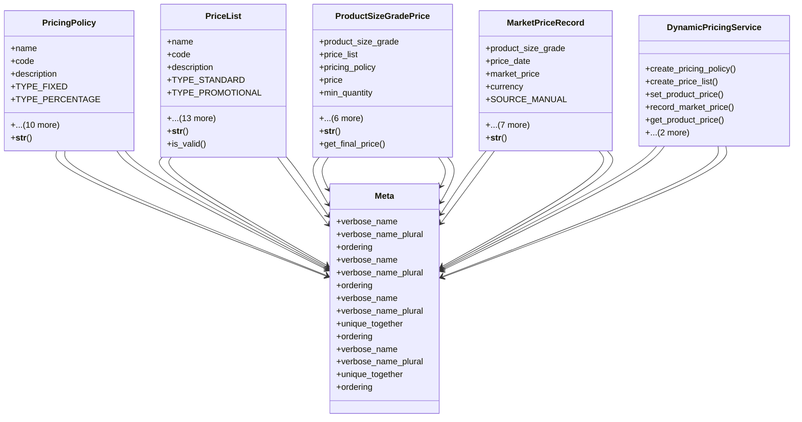

# agricultural_modules.production.product_grading.pricing

## Imports
- django.conf
- django.core.exceptions
- django.db
- django.utils
- django.utils.translation
- models

## Classes
- PricingPolicy
  - attr: `name`
  - attr: `code`
  - attr: `description`
  - attr: `TYPE_FIXED`
  - attr: `TYPE_PERCENTAGE`
  - attr: `TYPE_FORMULA`
  - attr: `TYPE_MARKET_BASED`
  - attr: `POLICY_TYPE_CHOICES`
  - attr: `policy_type`
  - attr: `formula`
  - attr: `is_active`
  - attr: `created_at`
  - attr: `updated_at`
  - attr: `created_by`
  - attr: `updated_by`
  - method: `__str__`
- PriceList
  - attr: `name`
  - attr: `code`
  - attr: `description`
  - attr: `TYPE_STANDARD`
  - attr: `TYPE_PROMOTIONAL`
  - attr: `TYPE_SEASONAL`
  - attr: `TYPE_CUSTOMER_SPECIFIC`
  - attr: `LIST_TYPE_CHOICES`
  - attr: `list_type`
  - attr: `valid_from`
  - attr: `valid_to`
  - attr: `currency`
  - attr: `notes`
  - attr: `is_active`
  - attr: `created_at`
  - attr: `updated_at`
  - attr: `created_by`
  - attr: `updated_by`
  - method: `__str__`
  - method: `is_valid`
- ProductSizeGradePrice
  - attr: `product_size_grade`
  - attr: `price_list`
  - attr: `pricing_policy`
  - attr: `price`
  - attr: `min_quantity`
  - attr: `discount_percentage`
  - attr: `notes`
  - attr: `created_at`
  - attr: `updated_at`
  - attr: `created_by`
  - attr: `updated_by`
  - method: `__str__`
  - method: `get_final_price`
- MarketPriceRecord
  - attr: `product_size_grade`
  - attr: `price_date`
  - attr: `market_price`
  - attr: `currency`
  - attr: `SOURCE_MANUAL`
  - attr: `SOURCE_API`
  - attr: `SOURCE_MARKET_REPORT`
  - attr: `SOURCE_CHOICES`
  - attr: `price_source`
  - attr: `notes`
  - attr: `created_at`
  - attr: `created_by`
  - method: `__str__`
- DynamicPricingService
  - method: `create_pricing_policy`
  - method: `create_price_list`
  - method: `set_product_price`
  - method: `record_market_price`
  - method: `get_product_price`
  - method: `calculate_price_based_on_policy`
  - method: `bulk_update_prices`
- Meta
  - attr: `verbose_name`
  - attr: `verbose_name_plural`
  - attr: `ordering`
- Meta
  - attr: `verbose_name`
  - attr: `verbose_name_plural`
  - attr: `ordering`
- Meta
  - attr: `verbose_name`
  - attr: `verbose_name_plural`
  - attr: `unique_together`
  - attr: `ordering`
- Meta
  - attr: `verbose_name`
  - attr: `verbose_name_plural`
  - attr: `unique_together`
  - attr: `ordering`

## Functions
- __str__
- __str__
- is_valid
- __str__
- get_final_price
- __str__
- create_pricing_policy
- create_price_list
- set_product_price
- record_market_price
- get_product_price
- calculate_price_based_on_policy
- bulk_update_prices

## Class Diagram

