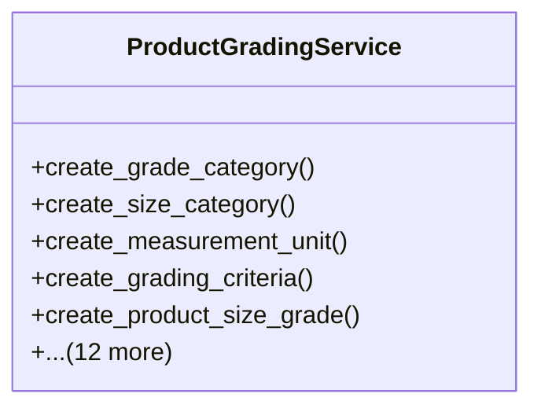

# agricultural_modules.production.product_grading.services

## Imports
- django.core.exceptions
- django.db
- django.utils
- django.utils.translation
- models

## Classes
- ProductGradingService
  - method: `create_grade_category`
  - method: `create_size_category`
  - method: `create_measurement_unit`
  - method: `create_grading_criteria`
  - method: `create_product_size_grade`
  - method: `add_criteria_to_product_size_grade`
  - method: `create_grading_result`
  - method: `add_criteria_result`
  - method: `update_grading_result_status`
  - method: `get_product_size_grades`
  - method: `get_batch_grading_results`
  - method: `get_grading_result_details`
  - method: `calculate_batch_grading_summary`
  - method: `get_product_grading_history`
  - method: `validate_grading_criteria_compliance`
  - method: `get_available_product_size_grades_for_market`
  - method: `get_product_size_grade_pricing`

## Functions
- create_grade_category
- create_size_category
- create_measurement_unit
- create_grading_criteria
- create_product_size_grade
- add_criteria_to_product_size_grade
- create_grading_result
- add_criteria_result
- update_grading_result_status
- get_product_size_grades
- get_batch_grading_results
- get_grading_result_details
- calculate_batch_grading_summary
- get_product_grading_history
- validate_grading_criteria_compliance
- get_available_product_size_grades_for_market
- get_product_size_grade_pricing

## Class Diagram

