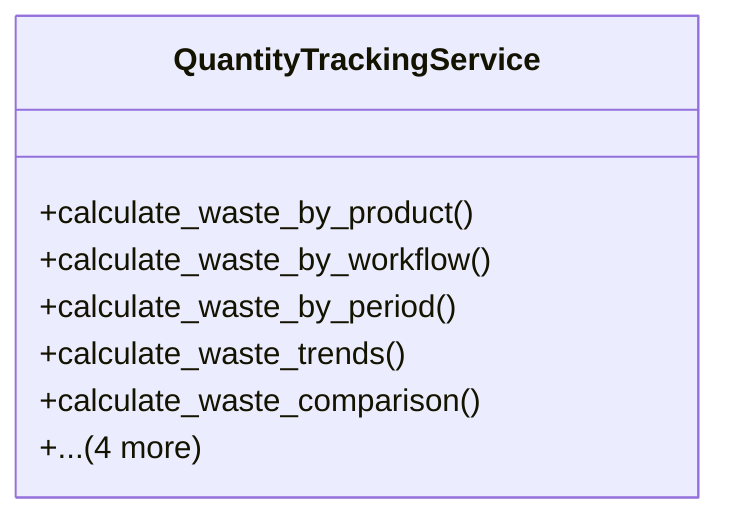

# agricultural_modules.production.quantity_tracking

## Imports
- django.conf
- django.core.exceptions
- django.db
- django.db.models
- django.utils
- django.utils.translation
- models
- workflow.models

## Classes
- QuantityTrackingService
  - method: `calculate_waste_by_product`
  - method: `calculate_waste_by_workflow`
  - method: `calculate_waste_by_period`
  - method: `calculate_waste_trends`
  - method: `calculate_waste_comparison`
  - method: `calculate_waste_by_batch`
  - method: `calculate_waste_by_stage_type`
  - method: `calculate_waste_summary`
  - method: `calculate_waste_for_grade_b_sales`

## Functions
- calculate_waste_by_product
- calculate_waste_by_workflow
- calculate_waste_by_period
- calculate_waste_trends
- calculate_waste_comparison
- calculate_waste_by_batch
- calculate_waste_by_stage_type
- calculate_waste_summary
- calculate_waste_for_grade_b_sales

## Class Diagram

