# agricultural_modules.production.services

## Imports
- django.contrib.auth.models
- django.db
- django.db.models
- django.utils
- django.utils.translation
- models

## Classes
- ProductionOrderService
  - method: `create_production_order`
  - method: `update_production_order`
  - method: `confirm_production_order`
  - method: `start_production_order`
  - method: `complete_production_order`
  - method: `cancel_production_order`
  - method: `get_production_orders`
  - method: `get_production_order_by_id`
  - method: `get_production_order_by_number`
  - method: `_generate_order_number`
- ProductionOperationService
  - method: `create_operation`
  - method: `update_operation`
  - method: `start_operation`
  - method: `complete_operation`
  - method: `get_operations_by_order`
  - method: `get_operation_by_id`
- ProductionBatchService
  - method: `create_batch`
  - method: `update_batch`
  - method: `get_batches_by_order`
  - method: `get_batch_by_id`
  - method: `get_batch_by_number`
  - method: `get_batch_by_lot`
  - method: `_generate_batch_number`
  - method: `_generate_lot_number`
- QualityTestService
  - method: `create_test`
  - method: `get_tests_by_batch`
  - method: `get_test_by_id`
- WasteSaleService
  - method: `create_waste_sale`
  - method: `get_waste_sales_by_order`
  - method: `get_waste_sale_by_id`
- BatchPackagingService
  - method: `create_batch_packaging`
  - method: `add_packaging_material`
  - method: `get_packaging_by_batch`
  - method: `get_packaging_by_id`
- BatchStorageService
  - method: `create_batch_storage`
  - method: `get_storage_by_batch`
  - method: `get_storage_by_id`
- ProductionReportService
  - method: `get_production_summary`
  - method: `get_batch_summary_by_grade`
  - method: `get_waste_sales_summary`
  - method: `get_operation_efficiency`

## Functions
- create_production_order
- update_production_order
- confirm_production_order
- start_production_order
- complete_production_order
- cancel_production_order
- get_production_orders
- get_production_order_by_id
- get_production_order_by_number
- _generate_order_number
- create_operation
- update_operation
- start_operation
- complete_operation
- get_operations_by_order
- get_operation_by_id
- create_batch
- update_batch
- get_batches_by_order
- get_batch_by_id
- get_batch_by_number
- get_batch_by_lot
- _generate_batch_number
- _generate_lot_number
- create_test
- get_tests_by_batch
- get_test_by_id
- create_waste_sale
- get_waste_sales_by_order
- get_waste_sale_by_id
- create_batch_packaging
- add_packaging_material
- get_packaging_by_batch
- get_packaging_by_id
- create_batch_storage
- get_storage_by_batch
- get_storage_by_id
- get_production_summary
- get_batch_summary_by_grade
- get_waste_sales_summary
- get_operation_efficiency

## Class Diagram

```mermaid
classDiagram
    class ProductionOrderService {
        +create_production_order()
        +update_production_order()
        +confirm_production_order()
        +start_production_order()
        +complete_production_order()
        +... (5 more)
    }
    class ProductionOperationService {
        +create_operation()
        +update_operation()
        +start_operation()
        +complete_operation()
        +get_operations_by_order()
        +... (1 more)
    }
    class ProductionBatchService {
        +create_batch()
        +update_batch()
        +get_batches_by_order()
        +get_batch_by_id()
        +get_batch_by_number()
        +... (3 more)
    }
    class QualityTestService {
        +create_test()
        +get_tests_by_batch()
        +get_test_by_id()
    }
    class WasteSaleService {
        +create_waste_sale()
        +get_waste_sales_by_order()
        +get_waste_sale_by_id()
    }
    class BatchPackagingService {
        +create_batch_packaging()
        +add_packaging_material()
        +get_packaging_by_batch()
        +get_packaging_by_id()
    }
    class BatchStorageService {
        +create_batch_storage()
        +get_storage_by_batch()
        +get_storage_by_id()
    }
    class ProductionReportService {
        +get_production_summary()
        +get_batch_summary_by_grade()
        +get_waste_sales_summary()
        +get_operation_efficiency()
    }
```

