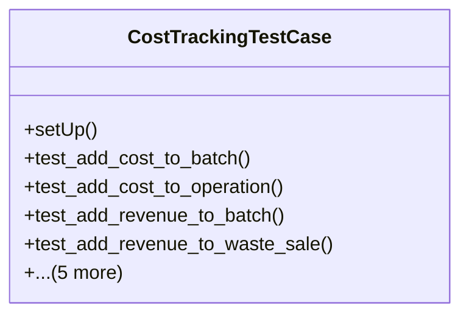

# agricultural_modules.production.tests.test_cost_tracking

## Imports
- cost_tracking
- decimal
- django.contrib.auth.models
- django.test
- django.utils
- inventory.models
- models

## Classes
- CostTrackingTestCase
  - method: `setUp`
  - method: `test_add_cost_to_batch`
  - method: `test_add_cost_to_operation`
  - method: `test_add_revenue_to_batch`
  - method: `test_add_revenue_to_waste_sale`
  - method: `test_calculate_batch_costs`
  - method: `test_calculate_batch_revenues`
  - method: `test_calculate_batch_profit_loss`
  - method: `test_generate_profit_loss_report`
  - method: `test_get_batch_profitability_analysis`

## Functions
- setUp
- test_add_cost_to_batch
- test_add_cost_to_operation
- test_add_revenue_to_batch
- test_add_revenue_to_waste_sale
- test_calculate_batch_costs
- test_calculate_batch_revenues
- test_calculate_batch_profit_loss
- test_generate_profit_loss_report
- test_get_batch_profitability_analysis

## Class Diagram

