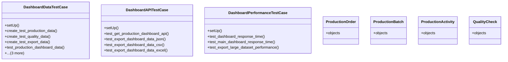

# agricultural_modules.production.tests.test_dashboards

## Imports
- analytics.dashboards
- certificates_models
- datetime
- django.contrib.auth
- django.test
- django.urls
- django.utils
- export_approval_models
- json
- models
- unittest.mock

## Classes
- DashboardDataTestCase
  - method: `setUp`
  - method: `create_test_production_data`
  - method: `create_test_quality_data`
  - method: `create_test_export_data`
  - method: `test_production_dashboard_data`
  - method: `test_quality_dashboard_data`
  - method: `test_export_dashboard_data`
  - method: `test_main_dashboard_data`
- DashboardAPITestCase
  - method: `setUp`
  - method: `test_get_production_dashboard_api`
  - method: `test_export_dashboard_data_json`
  - method: `test_export_dashboard_data_csv`
  - method: `test_export_dashboard_data_excel`
- DashboardPerformanceTestCase
  - method: `setUp`
  - method: `test_dashboard_response_time`
  - method: `test_main_dashboard_response_time`
  - method: `test_export_large_dataset_performance`
- ProductionOrder
  - attr: `objects`
- ProductionBatch
  - attr: `objects`
- ProductionActivity
  - attr: `objects`
- QualityCheck
  - attr: `objects`

## Functions
- setUp
- create_test_production_data
- create_test_quality_data
- create_test_export_data
- test_production_dashboard_data
- test_quality_dashboard_data
- test_export_dashboard_data
- test_main_dashboard_data
- setUp
- test_get_production_dashboard_api
- test_export_dashboard_data_json
- test_export_dashboard_data_csv
- test_export_dashboard_data_excel
- setUp
- test_dashboard_response_time
- test_main_dashboard_response_time
- test_export_large_dataset_performance

## Module Variables
- `missing_models`
- `User`

## Class Diagram

