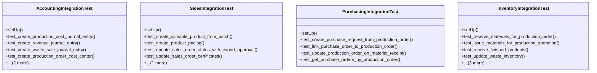

# agricultural_modules.production.tests.test_integration

## Imports
- agricultural_modules.production.accounting_integration
- agricultural_modules.production.inventory_integration
- agricultural_modules.production.purchasing_integration
- agricultural_modules.production.sales_integration
- datetime
- decimal
- django.test
- django.utils
- models
- unittest
- unittest.mock

## Classes
- AccountingIntegrationTest
  - method: `setUp`
  - method: `test_create_production_cost_journal_entry`
  - method: `test_create_revenue_journal_entry`
  - method: `test_create_waste_sale_journal_entry`
  - method: `test_create_production_order_cost_center`
  - method: `test_create_production_batch_inventory_entry`
  - method: `test_update_profit_loss_report`
- SalesIntegrationTest
  - method: `setUp`
  - method: `test_create_saleable_product_from_batch`
  - method: `test_create_product_pricing`
  - method: `test_update_sales_order_status_with_export_approval`
  - method: `test_update_sales_order_certificates`
  - method: `test_get_sales_orders_by_production_batch`
- PurchasingIntegrationTest
  - method: `setUp`
  - method: `test_create_purchase_request_from_production_order`
  - method: `test_link_purchase_order_to_production_order`
  - method: `test_update_production_order_on_material_receipt`
  - method: `test_get_purchase_orders_by_production_order`
- InventoryIntegrationTest
  - method: `setUp`
  - method: `test_reserve_materials_for_production_order`
  - method: `test_issue_materials_for_production_operation`
  - method: `test_receive_finished_products`
  - method: `test_update_waste_inventory`
  - method: `test_release_reserved_materials`
  - method: `test_check_material_availability`
  - method: `test_get_inventory_movements_by_production`

## Functions
- setUp
- test_create_production_cost_journal_entry
- test_create_revenue_journal_entry
- test_create_waste_sale_journal_entry
- test_create_production_order_cost_center
- test_create_production_batch_inventory_entry
- test_update_profit_loss_report
- setUp
- test_create_saleable_product_from_batch
- test_create_product_pricing
- test_update_sales_order_status_with_export_approval
- test_update_sales_order_certificates
- test_get_sales_orders_by_production_batch
- setUp
- test_create_purchase_request_from_production_order
- test_link_purchase_order_to_production_order
- test_update_production_order_on_material_receipt
- test_get_purchase_orders_by_production_order
- setUp
- test_reserve_materials_for_production_order
- test_issue_materials_for_production_operation
- test_receive_finished_products
- test_update_waste_inventory
- test_release_reserved_materials
- test_check_material_availability
- test_get_inventory_movements_by_production

## Class Diagram

