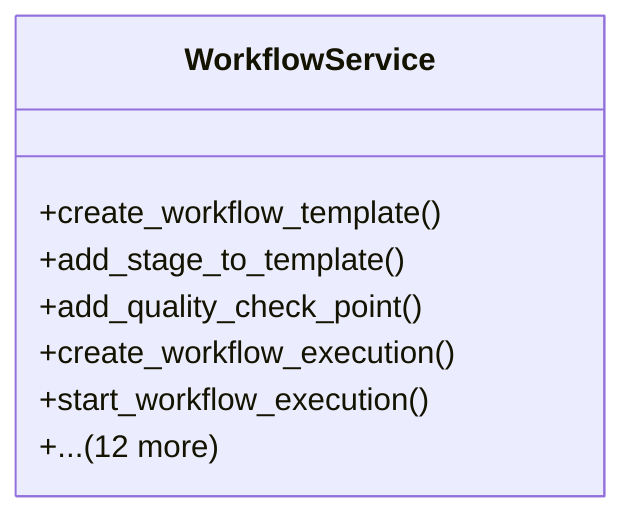

# agricultural_modules.production.workflow.services

## Imports
- django.conf
- django.core.exceptions
- django.db
- django.utils
- django.utils.translation
- inventory_integration
- logging
- models

## Classes
- WorkflowService
  - method: `create_workflow_template`
  - method: `add_stage_to_template`
  - method: `add_quality_check_point`
  - method: `create_workflow_execution`
  - method: `start_workflow_execution`
  - method: `start_stage_execution`
  - method: `complete_stage_execution`
  - method: `record_quality_check_result`
  - method: `cancel_workflow_execution`
  - method: `put_workflow_execution_on_hold`
  - method: `resume_workflow_execution`
  - method: `get_workflow_execution_progress`
  - method: `get_stage_execution_details`
  - method: `get_workflow_templates_for_product`
  - method: `create_seed_workflow_template`
  - method: `create_vegetable_workflow_template`
  - method: `create_fruit_workflow_template`

## Functions
- create_workflow_template
- add_stage_to_template
- add_quality_check_point
- create_workflow_execution
- start_workflow_execution
- start_stage_execution
- complete_stage_execution
- record_quality_check_result
- cancel_workflow_execution
- put_workflow_execution_on_hold
- resume_workflow_execution
- get_workflow_execution_progress
- get_stage_execution_details
- get_workflow_templates_for_product
- create_seed_workflow_template
- create_vegetable_workflow_template
- create_fruit_workflow_template

## Class Diagram

