# agricultural_modules.research.models

## Imports
- django.conf
- django.core.validators
- django.db
- django.utils
- django.utils.translation
- random
- string

## Classes
- ResearchProject
  - attr: `name`
  - attr: `code`
  - attr: `description`
  - attr: `objectives`
  - attr: `status`
  - attr: `start_date`
  - attr: `expected_end_date`
  - attr: `actual_end_date`
  - attr: `budget`
  - attr: `funding_source`
  - attr: `principal_investigator`
  - attr: `collaborating_institutions`
  - attr: `notes`
  - attr: `created_by`
  - attr: `created_at`
  - attr: `updated_by`
  - attr: `updated_at`
  - attr: `STATUS_PLANNING`
  - attr: `STATUS_IN_PROGRESS`
  - attr: `STATUS_COMPLETED`
  - attr: `STATUS_CANCELLED`
  - attr: `PRIORITY_LOW`
  - attr: `PRIORITY_MEDIUM`
  - attr: `PRIORITY_HIGH`
  - attr: `PRIORITY_CHOICES`
  - attr: `title`
  - attr: `priority`
  - attr: `keywords`
  - attr: `status_notes`
  - attr: `end_date`
  - method: `save`
  - method: `_generate_code`
  - method: `__str__`
  - method: `duration`
  - method: `is_active`
  - method: `is_completed`
  - method: `get_duration_days`
  - method: `get_team_members`
  - method: `get_experiments`
  - method: `get_publications`
  - method: `get_patents`
- ProjectTeamMember
  - attr: `project`
  - attr: `researcher`
  - attr: `ROLE_CHOICES`
  - attr: `role`
  - attr: `responsibilities`
  - attr: `join_date`
  - attr: `end_date`
  - attr: `is_active`
  - attr: `notes`
  - attr: `created_by`
  - attr: `created_at`
  - attr: `updated_by`
  - attr: `updated_at`
  - method: `__str__`
- ResearchExperiment
  - attr: `title`
  - attr: `code`
  - attr: `project`
  - attr: `description`
  - attr: `protocol`
  - attr: `status`
  - attr: `start_date`
  - attr: `end_date`
  - attr: `lead_researcher`
  - attr: `location`
  - attr: `equipment_used`
  - attr: `materials_used`
  - attr: `notes`
  - attr: `created_by`
  - attr: `created_at`
  - attr: `updated_by`
  - attr: `updated_at`
  - method: `__str__`
  - method: `is_active`
  - method: `is_completed`
  - method: `get_duration_days`
  - method: `get_participants`
  - method: `get_results`
- ExperimentParticipant
  - attr: `experiment`
  - attr: `researcher`
  - attr: `ROLE_CHOICES`
  - attr: `role`
  - attr: `responsibilities`
  - attr: `notes`
  - attr: `created_by`
  - attr: `created_at`
  - method: `__str__`
- ExperimentResult
  - attr: `experiment`
  - attr: `title`
  - attr: `description`
  - attr: `date_recorded`
  - attr: `numeric_data`
  - attr: `observations`
  - attr: `conclusions`
  - attr: `VERIFICATION_STATUS_CHOICES`
  - attr: `verification_status`
  - attr: `verified_by`
  - attr: `verification_date`
  - attr: `recorded_by`
  - attr: `created_at`
  - attr: `updated_by`
  - attr: `updated_at`
  - method: `__str__`
  - method: `is_verified`
- Researcher
  - attr: `user`
  - attr: `employee_id`
  - attr: `title`
  - attr: `specialization`
  - attr: `department`
  - attr: `bio`
  - attr: `education`
  - attr: `experience`
  - attr: `skills`
  - attr: `publications_count`
  - attr: `patents_count`
  - attr: `projects_count`
  - attr: `join_date`
  - attr: `is_active`
  - attr: `notes`
  - attr: `created_by`
  - attr: `created_at`
  - attr: `updated_by`
  - attr: `updated_at`
  - method: `__str__`
  - method: `get_full_name`
  - method: `get_projects`
  - method: `get_led_projects`
  - method: `get_experiments`
  - method: `get_led_experiments`
  - method: `get_publications`
  - method: `get_patents`
  - method: `update_counts`
- Publication
  - attr: `title`
  - attr: `abstract`
  - attr: `publication_type`
  - attr: `status`
  - attr: `journal_or_conference`
  - attr: `volume`
  - attr: `issue`
  - attr: `pages`
  - attr: `doi`
  - attr: `url`
  - attr: `publisher`
  - attr: `publication_date`
  - attr: `submission_date`
  - attr: `acceptance_date`
  - attr: `keywords`
  - attr: `projects`
  - attr: `notes`
  - attr: `created_by`
  - attr: `created_at`
  - attr: `updated_by`
  - attr: `updated_at`
  - method: `__str__`
  - method: `get_authors`
  - method: `get_citation`
- PublicationAuthor
  - attr: `publication`
  - attr: `researcher`
  - attr: `order`
  - attr: `is_corresponding`
  - attr: `contribution`
  - attr: `created_at`
  - method: `__str__`
- Patent
  - attr: `title`
  - attr: `description`
  - attr: `patent_number`
  - attr: `application_number`
  - attr: `filing_date`
  - attr: `grant_date`
  - attr: `expiry_date`
  - attr: `status`
  - attr: `patent_office`
  - attr: `country`
  - attr: `url`
  - attr: `projects`
  - attr: `notes`
  - attr: `created_by`
  - attr: `created_at`
  - attr: `updated_by`
  - attr: `updated_at`
  - method: `__str__`
  - method: `get_inventors`
  - method: `is_granted`
  - method: `is_active`
- PatentInventor
  - attr: `patent`
  - attr: `researcher`
  - attr: `order`
  - attr: `contribution`
  - attr: `created_at`
  - method: `__str__`
- ResearchGrant
  - attr: `title`
  - attr: `description`
  - attr: `grant_id`
  - attr: `funding_agency`
  - attr: `amount`
  - attr: `currency`
  - attr: `status`
  - attr: `submission_date`
  - attr: `start_date`
  - attr: `end_date`
  - attr: `projects`
  - attr: `principal_investigator`
  - attr: `co_investigators`
  - attr: `notes`
  - attr: `created_by`
  - attr: `created_at`
  - attr: `updated_by`
  - attr: `updated_at`
  - method: `__str__`
  - method: `is_active`
  - method: `get_duration_months`
- ResearchEquipment
  - attr: `name`
  - attr: `code`
  - attr: `description`
  - attr: `model`
  - attr: `manufacturer`
  - attr: `serial_number`
  - attr: `acquisition_date`
  - attr: `acquisition_cost`
  - attr: `currency`
  - attr: `location`
  - attr: `status`
  - attr: `last_maintenance_date`
  - attr: `next_maintenance_date`
  - attr: `last_calibration_date`
  - attr: `next_calibration_date`
  - attr: `responsible_person`
  - attr: `notes`
  - attr: `created_by`
  - attr: `created_at`
  - attr: `updated_by`
  - attr: `updated_at`
  - method: `__str__`
  - method: `is_operational`
  - method: `needs_maintenance`
  - method: `needs_calibration`
  - method: `get_experiments`
- ResearchReport
  - attr: `title`
  - attr: `project`
  - attr: `report_type`
  - attr: `status`
  - attr: `submission_date`
  - attr: `period_start`
  - attr: `period_end`
  - attr: `content`
  - attr: `summary`
  - attr: `conclusions`
  - attr: `recommendations`
  - attr: `reviewer`
  - attr: `review_date`
  - attr: `review_comments`
  - attr: `notes`
  - attr: `created_by`
  - attr: `created_at`
  - attr: `updated_by`
  - attr: `updated_at`
  - method: `__str__`
  - method: `is_approved`
  - method: `is_under_review`
  - method: `get_period_days`
- ResearchObjective
  - attr: `project`
  - attr: `title`
  - attr: `description`
  - attr: `success_criteria`
  - attr: `created_by`
  - attr: `created_at`
  - method: `__str__`
- ResearchTeamMember
  - attr: `ROLE_RESEARCHER`
  - attr: `ROLE_CHOICES`
  - attr: `project`
  - attr: `user`
  - attr: `role`
  - attr: `responsibilities`
  - attr: `created_by`
  - attr: `created_at`
  - method: `__str__`
- ResearchTask
  - attr: `STATUS_TODO`
  - attr: `STATUS_IN_PROGRESS`
  - attr: `STATUS_DONE`
  - attr: `STATUS_CHOICES`
  - attr: `PRIORITY_LOW`
  - attr: `PRIORITY_MEDIUM`
  - attr: `PRIORITY_HIGH`
  - attr: `PRIORITY_CHOICES`
  - attr: `project`
  - attr: `title`
  - attr: `description`
  - attr: `start_date`
  - attr: `due_date`
  - attr: `status`
  - attr: `priority`
  - attr: `assigned_to`
  - attr: `created_by`
  - attr: `created_at`
  - method: `__str__`
  - method: `duration`
- Meta
  - attr: `app_label`
  - attr: `verbose_name`
  - attr: `verbose_name_plural`
  - attr: `ordering`
- Meta
  - attr: `app_label`
  - attr: `verbose_name`
  - attr: `verbose_name_plural`
  - attr: `ordering`
  - attr: `unique_together`
- Meta
  - attr: `app_label`
  - attr: `verbose_name`
  - attr: `verbose_name_plural`
  - attr: `ordering`
- Meta
  - attr: `app_label`
  - attr: `verbose_name`
  - attr: `verbose_name_plural`
  - attr: `ordering`
  - attr: `unique_together`
- Meta
  - attr: `app_label`
  - attr: `verbose_name`
  - attr: `verbose_name_plural`
  - attr: `ordering`
- Meta
  - attr: `app_label`
  - attr: `verbose_name`
  - attr: `verbose_name_plural`
  - attr: `ordering`
- Meta
  - attr: `app_label`
  - attr: `verbose_name`
  - attr: `verbose_name_plural`
  - attr: `ordering`
- Meta
  - attr: `app_label`
  - attr: `verbose_name`
  - attr: `verbose_name_plural`
  - attr: `ordering`
  - attr: `unique_together`
- Meta
  - attr: `app_label`
  - attr: `verbose_name`
  - attr: `verbose_name_plural`
  - attr: `ordering`
- Meta
  - attr: `app_label`
  - attr: `verbose_name`
  - attr: `verbose_name_plural`
  - attr: `ordering`
  - attr: `unique_together`
- Meta
  - attr: `app_label`
  - attr: `verbose_name`
  - attr: `verbose_name_plural`
  - attr: `ordering`
- Meta
  - attr: `app_label`
  - attr: `verbose_name`
  - attr: `verbose_name_plural`
  - attr: `ordering`
- Meta
  - attr: `app_label`
  - attr: `verbose_name`
  - attr: `verbose_name_plural`
  - attr: `ordering`
- Meta
  - attr: `app_label`
  - attr: `verbose_name`
  - attr: `verbose_name_plural`
- Meta
  - attr: `app_label`
  - attr: `unique_together`
  - attr: `verbose_name`
  - attr: `verbose_name_plural`
- Meta
  - attr: `app_label`
  - attr: `verbose_name`
  - attr: `verbose_name_plural`

## Functions
- save
- _generate_code
- __str__
- duration
- is_active
- is_completed
- get_duration_days
- get_team_members
- get_experiments
- get_publications
- get_patents
- __str__
- __str__
- is_active
- is_completed
- get_duration_days
- get_participants
- get_results
- __str__
- __str__
- is_verified
- __str__
- get_full_name
- get_projects
- get_led_projects
- get_experiments
- get_led_experiments
- get_publications
- get_patents
- update_counts
- __str__
- get_authors
- get_citation
- __str__
- __str__
- get_inventors
- is_granted
- is_active
- __str__
- __str__
- is_active
- get_duration_months
- __str__
- is_operational
- needs_maintenance
- needs_calibration
- get_experiments
- __str__
- is_approved
- is_under_review
- get_period_days
- __str__
- __str__
- __str__
- duration

## Module Variables
- `PROJECT_STATUS_CHOICES`
- `EXPERIMENT_STATUS_CHOICES`
- `PUBLICATION_TYPE_CHOICES`
- `PUBLICATION_STATUS_CHOICES`
- `PATENT_STATUS_CHOICES`
- `GRANT_STATUS_CHOICES`
- `EQUIPMENT_STATUS_CHOICES`
- `REPORT_TYPE_CHOICES`
- `REPORT_STATUS_CHOICES`
- `ResearchPublication`
- `ResearchResult`
- `ResearchResource`
- `ResearchDataset`
- `ResearchAnalysis`
- `ResearchFunding`
- `ResearchMethodology`
- `ResearchCollaboration`

## Class Diagram

```mermaid
classDiagram
    class ResearchProject {
        +name
        +code
        +description
        +objectives
        +status
        +... (25 more)
        +save()
        +_generate_code()
        +__str__()
        +duration()
        +is_active()
        +... (6 more)
    }
    class ProjectTeamMember {
        +project
        +researcher
        +ROLE_CHOICES
        +role
        +responsibilities
        +... (8 more)
        +__str__()
    }
    class ResearchExperiment {
        +title
        +code
        +project
        +description
        +protocol
        +... (12 more)
        +__str__()
        +is_active()
        +is_completed()
        +get_duration_days()
        +get_participants()
        +... (1 more)
    }
    class ExperimentParticipant {
        +experiment
        +researcher
        +ROLE_CHOICES
        +role
        +responsibilities
        +... (3 more)
        +__str__()
    }
    class ExperimentResult {
        +experiment
        +title
        +description
        +date_recorded
        +numeric_data
        +... (10 more)
        +__str__()
        +is_verified()
    }
    class Researcher {
        +user
        +employee_id
        +title
        +specialization
        +department
        +... (14 more)
        +__str__()
        +get_full_name()
        +get_projects()
        +get_led_projects()
        +get_experiments()
        +... (4 more)
    }
    class Publication {
        +title
        +abstract
        +publication_type
        +status
        +journal_or_conference
        +... (16 more)
        +__str__()
        +get_authors()
        +get_citation()
    }
    class PublicationAuthor {
        +publication
        +researcher
        +order
        +is_corresponding
        +contribution
        +... (1 more)
        +__str__()
    }
    class Patent {
        +title
        +description
        +patent_number
        +application_number
        +filing_date
        +... (12 more)
        +__str__()
        +get_inventors()
        +is_granted()
        +is_active()
    }
    class PatentInventor {
        +patent
        +researcher
        +order
        +contribution
        +created_at
        +__str__()
    }
    class ResearchGrant {
        +title
        +description
        +grant_id
        +funding_agency
        +amount
        +... (13 more)
        +__str__()
        +is_active()
        +get_duration_months()
    }
    class ResearchEquipment {
        +name
        +code
        +description
        +model
        +manufacturer
        +... (16 more)
        +__str__()
        +is_operational()
        +needs_maintenance()
        +needs_calibration()
        +get_experiments()
    }
    class ResearchReport {
        +title
        +project
        +report_type
        +status
        +submission_date
        +... (14 more)
        +__str__()
        +is_approved()
        +is_under_review()
        +get_period_days()
    }
    class ResearchObjective {
        +project
        +title
        +description
        +success_criteria
        +created_by
        +... (1 more)
        +__str__()
    }
    class ResearchTeamMember {
        +ROLE_RESEARCHER
        +ROLE_CHOICES
        +project
        +user
        +role
        +... (3 more)
        +__str__()
    }
    class ResearchTask {
        +STATUS_TODO
        +STATUS_IN_PROGRESS
        +STATUS_DONE
        +STATUS_CHOICES
        +PRIORITY_LOW
        +... (13 more)
        +__str__()
        +duration()
    }
    class Meta {
        +app_label
        +verbose_name
        +verbose_name_plural
        +ordering
    }
    class Meta {
        +app_label
        +verbose_name
        +verbose_name_plural
        +ordering
        +unique_together
    }
    class Meta {
        +app_label
        +verbose_name
        +verbose_name_plural
        +ordering
    }
    class Meta {
        +app_label
        +verbose_name
        +verbose_name_plural
        +ordering
        +unique_together
    }
    class Meta {
        +app_label
        +verbose_name
        +verbose_name_plural
        +ordering
    }
    class Meta {
        +app_label
        +verbose_name
        +verbose_name_plural
        +ordering
    }
    class Meta {
        +app_label
        +verbose_name
        +verbose_name_plural
        +ordering
    }
    class Meta {
        +app_label
        +verbose_name
        +verbose_name_plural
        +ordering
        +unique_together
    }
    class Meta {
        +app_label
        +verbose_name
        +verbose_name_plural
        +ordering
    }
    class Meta {
        +app_label
        +verbose_name
        +verbose_name_plural
        +ordering
        +unique_together
    }
    class Meta {
        +app_label
        +verbose_name
        +verbose_name_plural
        +ordering
    }
    class Meta {
        +app_label
        +verbose_name
        +verbose_name_plural
        +ordering
    }
    class Meta {
        +app_label
        +verbose_name
        +verbose_name_plural
        +ordering
    }
    class Meta {
        +app_label
        +verbose_name
        +verbose_name_plural
    }
    class Meta {
        +app_label
        +unique_together
        +verbose_name
        +verbose_name_plural
    }
    class Meta {
        +app_label
        +verbose_name
        +verbose_name_plural
    }
    ResearchProject --> Meta
    ResearchProject --> Meta
    ResearchProject --> Meta
    ResearchProject --> Meta
    ResearchProject --> Meta
    ResearchProject --> Meta
    ResearchProject --> Meta
    ResearchProject --> Meta
    ResearchProject --> Meta
    ResearchProject --> Meta
    ResearchProject --> Meta
    ResearchProject --> Meta
    ResearchProject --> Meta
    ResearchProject --> Meta
    ResearchProject --> Meta
    ResearchProject --> Meta
    ProjectTeamMember --> Meta
    ProjectTeamMember --> Meta
    ProjectTeamMember --> Meta
    ProjectTeamMember --> Meta
    ProjectTeamMember --> Meta
    ProjectTeamMember --> Meta
    ProjectTeamMember --> Meta
    ProjectTeamMember --> Meta
    ProjectTeamMember --> Meta
    ProjectTeamMember --> Meta
    ProjectTeamMember --> Meta
    ProjectTeamMember --> Meta
    ProjectTeamMember --> Meta
    ProjectTeamMember --> Meta
    ProjectTeamMember --> Meta
    ProjectTeamMember --> Meta
    ResearchExperiment --> Meta
    ResearchExperiment --> Meta
    ResearchExperiment --> Meta
    ResearchExperiment --> Meta
    ResearchExperiment --> Meta
    ResearchExperiment --> Meta
    ResearchExperiment --> Meta
    ResearchExperiment --> Meta
    ResearchExperiment --> Meta
    ResearchExperiment --> Meta
    ResearchExperiment --> Meta
    ResearchExperiment --> Meta
    ResearchExperiment --> Meta
    ResearchExperiment --> Meta
    ResearchExperiment --> Meta
    ResearchExperiment --> Meta
    ExperimentParticipant --> Meta
    ExperimentParticipant --> Meta
    ExperimentParticipant --> Meta
    ExperimentParticipant --> Meta
    ExperimentParticipant --> Meta
    ExperimentParticipant --> Meta
    ExperimentParticipant --> Meta
    ExperimentParticipant --> Meta
    ExperimentParticipant --> Meta
    ExperimentParticipant --> Meta
    ExperimentParticipant --> Meta
    ExperimentParticipant --> Meta
    ExperimentParticipant --> Meta
    ExperimentParticipant --> Meta
    ExperimentParticipant --> Meta
    ExperimentParticipant --> Meta
    ExperimentResult --> Meta
    ExperimentResult --> Meta
    ExperimentResult --> Meta
    ExperimentResult --> Meta
    ExperimentResult --> Meta
    ExperimentResult --> Meta
    ExperimentResult --> Meta
    ExperimentResult --> Meta
    ExperimentResult --> Meta
    ExperimentResult --> Meta
    ExperimentResult --> Meta
    ExperimentResult --> Meta
    ExperimentResult --> Meta
    ExperimentResult --> Meta
    ExperimentResult --> Meta
    ExperimentResult --> Meta
    Researcher --> Meta
    Researcher --> Meta
    Researcher --> Meta
    Researcher --> Meta
    Researcher --> Meta
    Researcher --> Meta
    Researcher --> Meta
    Researcher --> Meta
    Researcher --> Meta
    Researcher --> Meta
    Researcher --> Meta
    Researcher --> Meta
    Researcher --> Meta
    Researcher --> Meta
    Researcher --> Meta
    Researcher --> Meta
    Publication --> Meta
    Publication --> Meta
    Publication --> Meta
    Publication --> Meta
    Publication --> Meta
    Publication --> Meta
    Publication --> Meta
    Publication --> Meta
    Publication --> Meta
    Publication --> Meta
    Publication --> Meta
    Publication --> Meta
    Publication --> Meta
    Publication --> Meta
    Publication --> Meta
    Publication --> Meta
    PublicationAuthor --> Meta
    PublicationAuthor --> Meta
    PublicationAuthor --> Meta
    PublicationAuthor --> Meta
    PublicationAuthor --> Meta
    PublicationAuthor --> Meta
    PublicationAuthor --> Meta
    PublicationAuthor --> Meta
    PublicationAuthor --> Meta
    PublicationAuthor --> Meta
    PublicationAuthor --> Meta
    PublicationAuthor --> Meta
    PublicationAuthor --> Meta
    PublicationAuthor --> Meta
    PublicationAuthor --> Meta
    PublicationAuthor --> Meta
    Patent --> Meta
    Patent --> Meta
    Patent --> Meta
    Patent --> Meta
    Patent --> Meta
    Patent --> Meta
    Patent --> Meta
    Patent --> Meta
    Patent --> Meta
    Patent --> Meta
    Patent --> Meta
    Patent --> Meta
    Patent --> Meta
    Patent --> Meta
    Patent --> Meta
    Patent --> Meta
    PatentInventor --> Meta
    PatentInventor --> Meta
    PatentInventor --> Meta
    PatentInventor --> Meta
    PatentInventor --> Meta
    PatentInventor --> Meta
    PatentInventor --> Meta
    PatentInventor --> Meta
    PatentInventor --> Meta
    PatentInventor --> Meta
    PatentInventor --> Meta
    PatentInventor --> Meta
    PatentInventor --> Meta
    PatentInventor --> Meta
    PatentInventor --> Meta
    PatentInventor --> Meta
    ResearchGrant --> Meta
    ResearchGrant --> Meta
    ResearchGrant --> Meta
    ResearchGrant --> Meta
    ResearchGrant --> Meta
    ResearchGrant --> Meta
    ResearchGrant --> Meta
    ResearchGrant --> Meta
    ResearchGrant --> Meta
    ResearchGrant --> Meta
    ResearchGrant --> Meta
    ResearchGrant --> Meta
    ResearchGrant --> Meta
    ResearchGrant --> Meta
    ResearchGrant --> Meta
    ResearchGrant --> Meta
    ResearchEquipment --> Meta
    ResearchEquipment --> Meta
    ResearchEquipment --> Meta
    ResearchEquipment --> Meta
    ResearchEquipment --> Meta
    ResearchEquipment --> Meta
    ResearchEquipment --> Meta
    ResearchEquipment --> Meta
    ResearchEquipment --> Meta
    ResearchEquipment --> Meta
    ResearchEquipment --> Meta
    ResearchEquipment --> Meta
    ResearchEquipment --> Meta
    ResearchEquipment --> Meta
    ResearchEquipment --> Meta
    ResearchEquipment --> Meta
    ResearchReport --> Meta
    ResearchReport --> Meta
    ResearchReport --> Meta
    ResearchReport --> Meta
    ResearchReport --> Meta
    ResearchReport --> Meta
    ResearchReport --> Meta
    ResearchReport --> Meta
    ResearchReport --> Meta
    ResearchReport --> Meta
    ResearchReport --> Meta
    ResearchReport --> Meta
    ResearchReport --> Meta
    ResearchReport --> Meta
    ResearchReport --> Meta
    ResearchReport --> Meta
    ResearchObjective --> Meta
    ResearchObjective --> Meta
    ResearchObjective --> Meta
    ResearchObjective --> Meta
    ResearchObjective --> Meta
    ResearchObjective --> Meta
    ResearchObjective --> Meta
    ResearchObjective --> Meta
    ResearchObjective --> Meta
    ResearchObjective --> Meta
    ResearchObjective --> Meta
    ResearchObjective --> Meta
    ResearchObjective --> Meta
    ResearchObjective --> Meta
    ResearchObjective --> Meta
    ResearchObjective --> Meta
    ResearchTeamMember --> Meta
    ResearchTeamMember --> Meta
    ResearchTeamMember --> Meta
    ResearchTeamMember --> Meta
    ResearchTeamMember --> Meta
    ResearchTeamMember --> Meta
    ResearchTeamMember --> Meta
    ResearchTeamMember --> Meta
    ResearchTeamMember --> Meta
    ResearchTeamMember --> Meta
    ResearchTeamMember --> Meta
    ResearchTeamMember --> Meta
    ResearchTeamMember --> Meta
    ResearchTeamMember --> Meta
    ResearchTeamMember --> Meta
    ResearchTeamMember --> Meta
    ResearchTask --> Meta
    ResearchTask --> Meta
    ResearchTask --> Meta
    ResearchTask --> Meta
    ResearchTask --> Meta
    ResearchTask --> Meta
    ResearchTask --> Meta
    ResearchTask --> Meta
    ResearchTask --> Meta
    ResearchTask --> Meta
    ResearchTask --> Meta
    ResearchTask --> Meta
    ResearchTask --> Meta
    ResearchTask --> Meta
    ResearchTask --> Meta
    ResearchTask --> Meta
```

