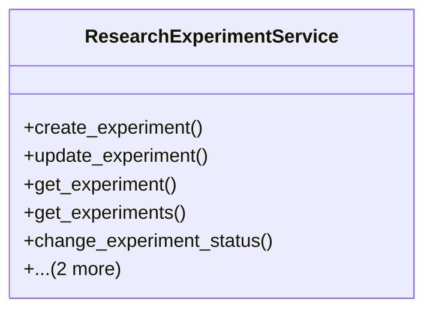

# agricultural_modules.research.services.research_experiment_service

## Imports
- django.core.exceptions
- django.db
- django.db.models
- django.utils
- django.utils.translation
- models

## Classes
- ResearchExperimentService
  - method: `create_experiment`
  - method: `update_experiment`
  - method: `get_experiment`
  - method: `get_experiments`
  - method: `change_experiment_status`
  - method: `add_participant`
  - method: `remove_participant`

## Functions
- create_experiment
- update_experiment
- get_experiment
- get_experiments
- change_experiment_status
- add_participant
- remove_participant

## Class Diagram

