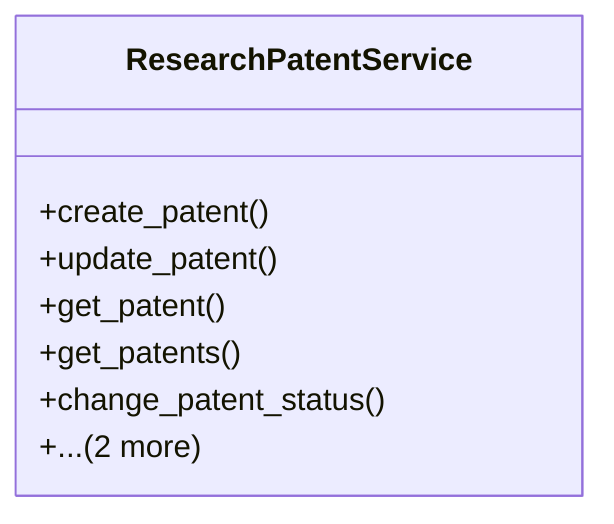

# agricultural_modules.research.services.research_patent_service

## Imports
- django.core.exceptions
- django.db
- django.db.models
- django.utils.translation
- models

## Classes
- ResearchPatentService
  - method: `create_patent`
  - method: `update_patent`
  - method: `get_patent`
  - method: `get_patents`
  - method: `change_patent_status`
  - method: `add_inventor`
  - method: `remove_inventor`

## Functions
- create_patent
- update_patent
- get_patent
- get_patents
- change_patent_status
- add_inventor
- remove_inventor

## Class Diagram

