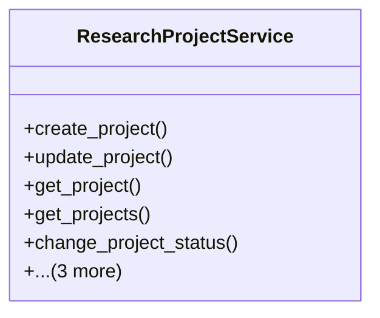

# agricultural_modules.research.services.research_project_service

## Imports
- django.core.exceptions
- django.db
- django.db.models
- django.utils
- django.utils.translation
- models

## Classes
- ResearchProjectService
  - method: `create_project`
  - method: `update_project`
  - method: `get_project`
  - method: `get_projects`
  - method: `change_project_status`
  - method: `add_team_member`
  - method: `remove_team_member`
  - method: `get_project_statistics`

## Functions
- create_project
- update_project
- get_project
- get_projects
- change_project_status
- add_team_member
- remove_team_member
- get_project_statistics

## Class Diagram

