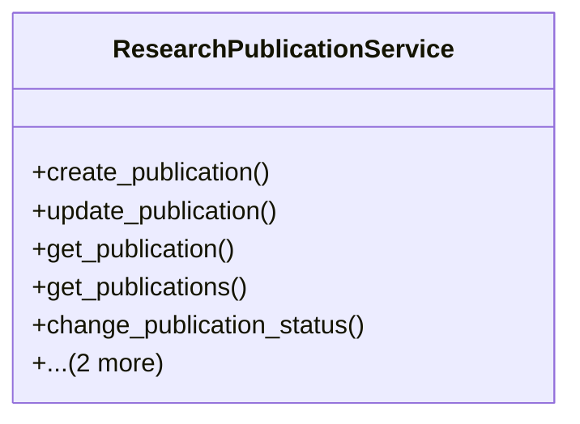

# agricultural_modules.research.services.research_publication_service

## Imports
- django.core.exceptions
- django.db
- django.db.models
- django.utils.translation
- models

## Classes
- ResearchPublicationService
  - method: `create_publication`
  - method: `update_publication`
  - method: `get_publication`
  - method: `get_publications`
  - method: `change_publication_status`
  - method: `add_author`
  - method: `remove_author`

## Functions
- create_publication
- update_publication
- get_publication
- get_publications
- change_publication_status
- add_author
- remove_author

## Class Diagram

