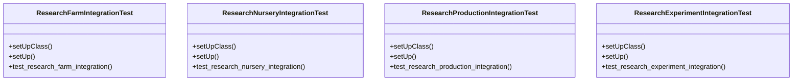

# agricultural_modules.research.tests.test_integration

## Imports
- agricultural_modules.experiments.models
- agricultural_modules.experiments.services
- agricultural_modules.farms.models
- agricultural_modules.farms.services
- agricultural_modules.nurseries.models
- agricultural_modules.nurseries.services
- agricultural_modules.production.models
- agricultural_modules.production.services
- datetime
- django.contrib.auth
- django.test
- django.utils
- models
- services

## Classes
- ResearchFarmIntegrationTest
  - method: `setUpClass`
  - method: `setUp`
  - method: `test_research_farm_integration`
- ResearchNurseryIntegrationTest
  - method: `setUpClass`
  - method: `setUp`
  - method: `test_research_nursery_integration`
- ResearchProductionIntegrationTest
  - method: `setUpClass`
  - method: `setUp`
  - method: `test_research_production_integration`
- ResearchExperimentIntegrationTest
  - method: `setUpClass`
  - method: `setUp`
  - method: `test_research_experiment_integration`

## Functions
- setUpClass
- setUp
- test_research_farm_integration
- setUpClass
- setUp
- test_research_nursery_integration
- setUpClass
- setUp
- test_research_production_integration
- setUpClass
- setUp
- test_research_experiment_integration

## Module Variables
- `User`

## Class Diagram

