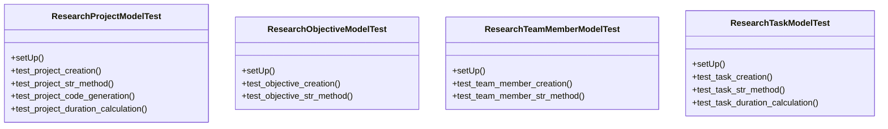

# agricultural_modules.research.tests.test_models

## Imports
- datetime
- django.contrib.auth
- django.test
- django.utils
- models

## Classes
- ResearchProjectModelTest
  - method: `setUp`
  - method: `test_project_creation`
  - method: `test_project_str_method`
  - method: `test_project_code_generation`
  - method: `test_project_duration_calculation`
- ResearchObjectiveModelTest
  - method: `setUp`
  - method: `test_objective_creation`
  - method: `test_objective_str_method`
- ResearchTeamMemberModelTest
  - method: `setUp`
  - method: `test_team_member_creation`
  - method: `test_team_member_str_method`
- ResearchTaskModelTest
  - method: `setUp`
  - method: `test_task_creation`
  - method: `test_task_str_method`
  - method: `test_task_duration_calculation`

## Functions
- setUp
- test_project_creation
- test_project_str_method
- test_project_code_generation
- test_project_duration_calculation
- setUp
- test_objective_creation
- test_objective_str_method
- setUp
- test_team_member_creation
- test_team_member_str_method
- setUp
- test_task_creation
- test_task_str_method
- test_task_duration_calculation

## Module Variables
- `User`

## Class Diagram

