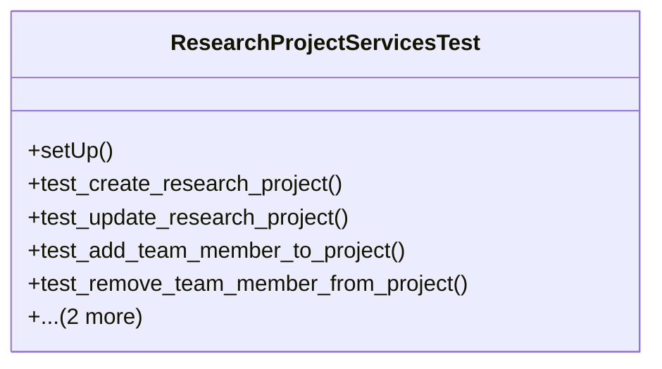

# agricultural_modules.research.tests.test_services

## Imports
- datetime
- django.contrib.auth
- django.test
- django.utils
- models
- services

## Classes
- ResearchProjectServicesTest
  - method: `setUp`
  - method: `test_create_research_project`
  - method: `test_update_research_project`
  - method: `test_add_team_member_to_project`
  - method: `test_remove_team_member_from_project`
  - method: `test_add_objective_to_project`
  - method: `test_update_project_status`

## Functions
- setUp
- test_create_research_project
- test_update_research_project
- test_add_team_member_to_project
- test_remove_team_member_from_project
- test_add_objective_to_project
- test_update_project_status

## Module Variables
- `User`

## Class Diagram

