# agricultural_modules.research.views

## Imports
- django.db.models
- django_filters.rest_framework
- models
- rest_framework
- rest_framework.decorators
- rest_framework.response
- serializers
- services

## Classes
- ResearchProjectViewSet
  - attr: `queryset`
  - attr: `filter_backends`
  - attr: `filterset_fields`
  - attr: `search_fields`
  - attr: `ordering_fields`
  - method: `get_serializer_class`
  - method: `get_permissions`
  - method: `perform_create`
  - method: `perform_update`
  - method: `add_team_member`
  - method: `remove_team_member`
  - method: `add_objective`
  - method: `update_status`
  - method: `generate_report`
  - method: `progress`
  - method: `timeline`
  - method: `resources_utilization`
  - method: `budget_status`
  - method: `publications_metrics`
- ResearchObjectiveViewSet
  - attr: `queryset`
  - attr: `serializer_class`
  - attr: `filter_backends`
  - attr: `filterset_fields`
  - attr: `search_fields`
- ResearchMethodologyViewSet
  - attr: `queryset`
  - attr: `serializer_class`
  - attr: `filter_backends`
  - attr: `filterset_fields`
  - attr: `search_fields`
- ResearchTeamMemberViewSet
  - attr: `queryset`
  - attr: `serializer_class`
  - attr: `filter_backends`
  - attr: `filterset_fields`
  - attr: `search_fields`
- ResearchResourceViewSet
  - attr: `queryset`
  - attr: `serializer_class`
  - attr: `filter_backends`
  - attr: `filterset_fields`
  - attr: `search_fields`
- ResearchTaskViewSet
  - attr: `queryset`
  - attr: `serializer_class`
  - attr: `filter_backends`
  - attr: `filterset_fields`
  - attr: `search_fields`
- ResearchResultViewSet
  - attr: `queryset`
  - attr: `serializer_class`
  - attr: `filter_backends`
  - attr: `filterset_fields`
  - attr: `search_fields`
- ResearchPublicationViewSet
  - attr: `queryset`
  - attr: `serializer_class`
  - attr: `filter_backends`
  - attr: `filterset_fields`
  - attr: `search_fields`
- ResearchCollaborationViewSet
  - attr: `queryset`
  - attr: `serializer_class`
  - attr: `filter_backends`
  - attr: `filterset_fields`
  - attr: `search_fields`
- ResearchFundingViewSet
  - attr: `queryset`
  - attr: `serializer_class`
  - attr: `filter_backends`
  - attr: `filterset_fields`
  - attr: `search_fields`
- ResearchDatasetViewSet
  - attr: `queryset`
  - attr: `serializer_class`
  - attr: `filter_backends`
  - attr: `filterset_fields`
  - attr: `search_fields`
- ResearchAnalysisViewSet
  - attr: `queryset`
  - attr: `serializer_class`
  - attr: `filter_backends`
  - attr: `filterset_fields`
  - attr: `search_fields`

## Functions
- get_serializer_class
- get_permissions
- perform_create
- perform_update
- add_team_member
- remove_team_member
- add_objective
- update_status
- generate_report
- progress
- timeline
- resources_utilization
- budget_status
- publications_metrics

## Class Diagram

```mermaid
classDiagram
    class ResearchProjectViewSet {
        +queryset
        +filter_backends
        +filterset_fields
        +search_fields
        +ordering_fields
        +get_serializer_class()
        +get_permissions()
        +perform_create()
        +perform_update()
        +add_team_member()
        +... (9 more)
    }
    class ResearchObjectiveViewSet {
        +queryset
        +serializer_class
        +filter_backends
        +filterset_fields
        +search_fields
    }
    class ResearchMethodologyViewSet {
        +queryset
        +serializer_class
        +filter_backends
        +filterset_fields
        +search_fields
    }
    class ResearchTeamMemberViewSet {
        +queryset
        +serializer_class
        +filter_backends
        +filterset_fields
        +search_fields
    }
    class ResearchResourceViewSet {
        +queryset
        +serializer_class
        +filter_backends
        +filterset_fields
        +search_fields
    }
    class ResearchTaskViewSet {
        +queryset
        +serializer_class
        +filter_backends
        +filterset_fields
        +search_fields
    }
    class ResearchResultViewSet {
        +queryset
        +serializer_class
        +filter_backends
        +filterset_fields
        +search_fields
    }
    class ResearchPublicationViewSet {
        +queryset
        +serializer_class
        +filter_backends
        +filterset_fields
        +search_fields
    }
    class ResearchCollaborationViewSet {
        +queryset
        +serializer_class
        +filter_backends
        +filterset_fields
        +search_fields
    }
    class ResearchFundingViewSet {
        +queryset
        +serializer_class
        +filter_backends
        +filterset_fields
        +search_fields
    }
    class ResearchDatasetViewSet {
        +queryset
        +serializer_class
        +filter_backends
        +filterset_fields
        +search_fields
    }
    class ResearchAnalysisViewSet {
        +queryset
        +serializer_class
        +filter_backends
        +filterset_fields
        +search_fields
    }
```

