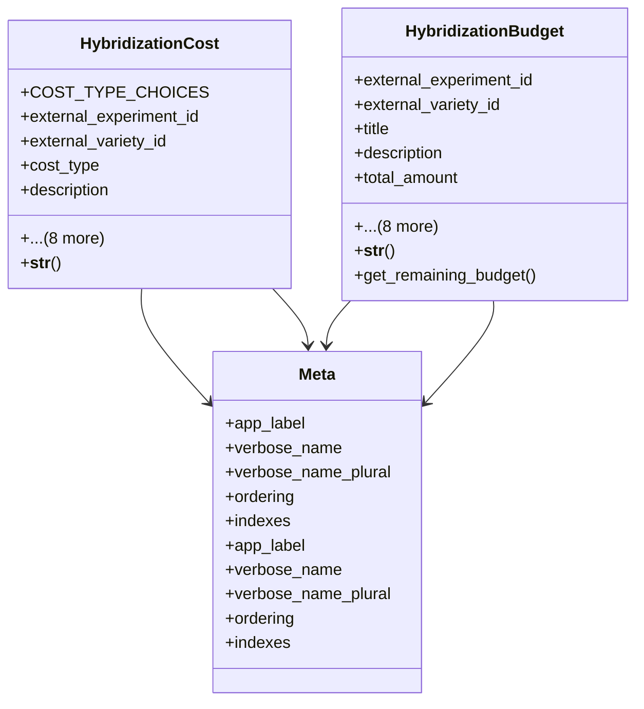

# agricultural_modules.seed_hybridization.cost_tracking

## Imports
- django.contrib.auth
- django.db
- django.db.models
- django.utils

## Classes
- HybridizationCost
  - attr: `COST_TYPE_CHOICES`
  - attr: `external_experiment_id`
  - attr: `external_variety_id`
  - attr: `cost_type`
  - attr: `description`
  - attr: `amount`
  - attr: `currency`
  - attr: `date_incurred`
  - attr: `created_at`
  - attr: `updated_at`
  - attr: `created_by`
  - attr: `updated_by`
  - attr: `notes`
  - method: `__str__`
- HybridizationBudget
  - attr: `external_experiment_id`
  - attr: `external_variety_id`
  - attr: `title`
  - attr: `description`
  - attr: `total_amount`
  - attr: `currency`
  - attr: `start_date`
  - attr: `end_date`
  - attr: `created_at`
  - attr: `updated_at`
  - attr: `created_by`
  - attr: `updated_by`
  - attr: `is_active`
  - method: `__str__`
  - method: `get_remaining_budget`
- Meta
  - attr: `app_label`
  - attr: `verbose_name`
  - attr: `verbose_name_plural`
  - attr: `ordering`
  - attr: `indexes`
- Meta
  - attr: `app_label`
  - attr: `verbose_name`
  - attr: `verbose_name_plural`
  - attr: `ordering`
  - attr: `indexes`

## Functions
- add_hybridization_cost
- get_hybridization_costs
- add_hybridization_budget
- get_hybridization_budget_status
- __str__
- __str__
- get_remaining_budget

## Module Variables
- `User`

## Class Diagram

